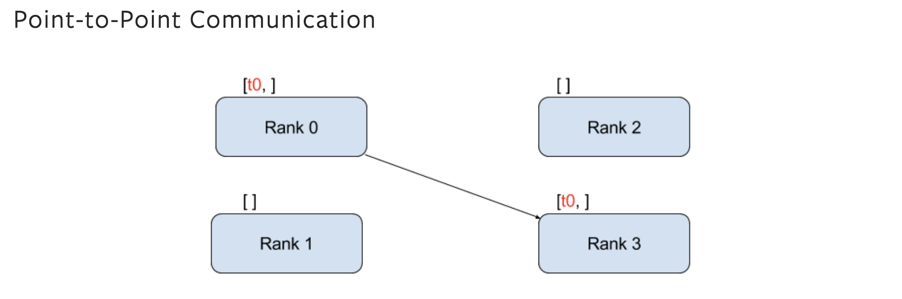
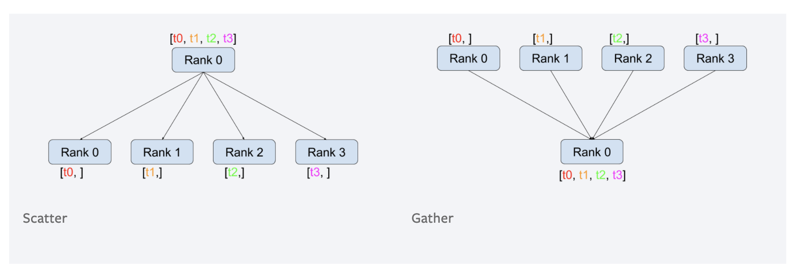
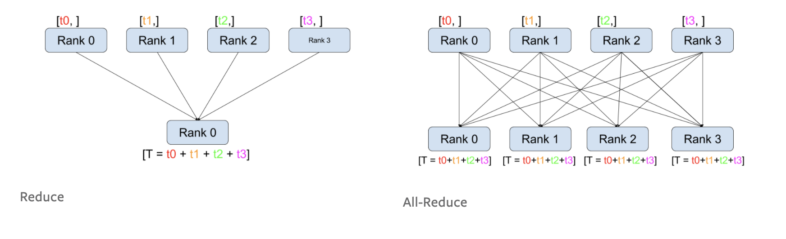
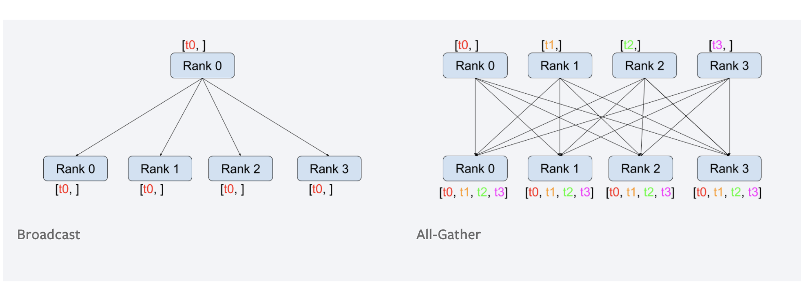
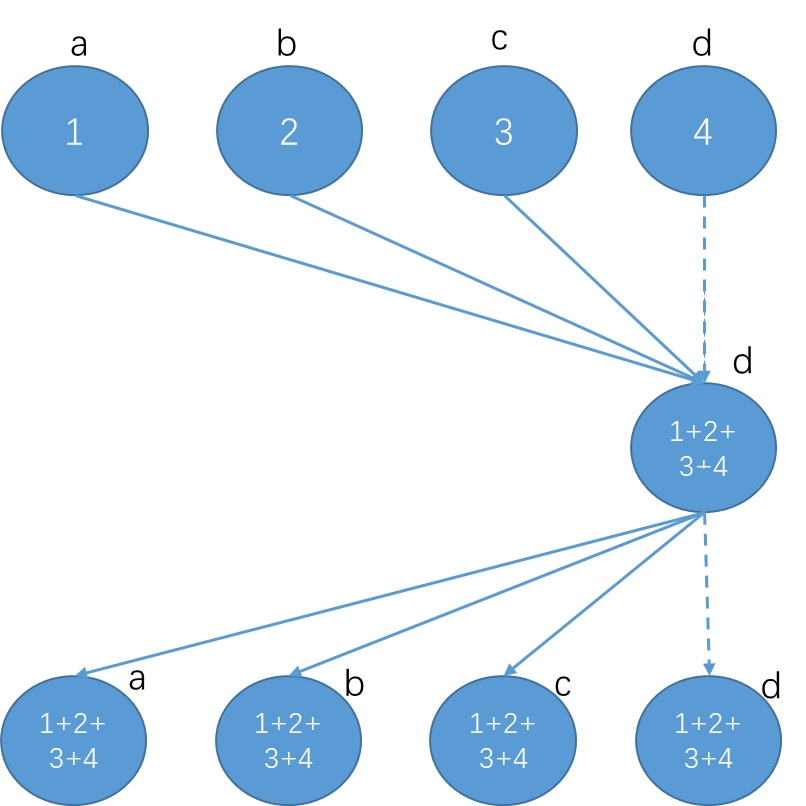
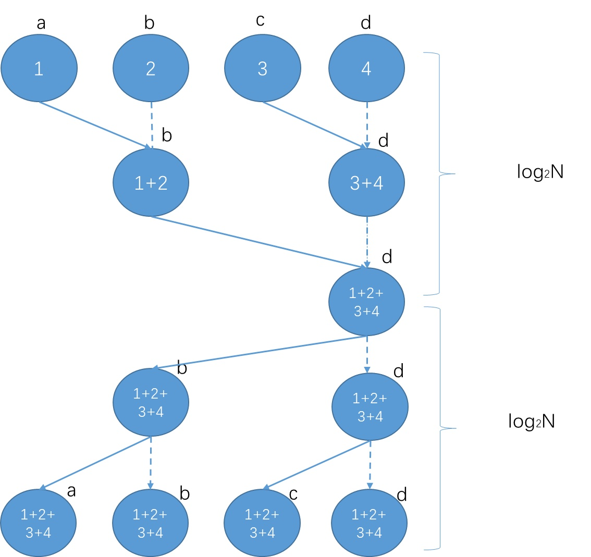
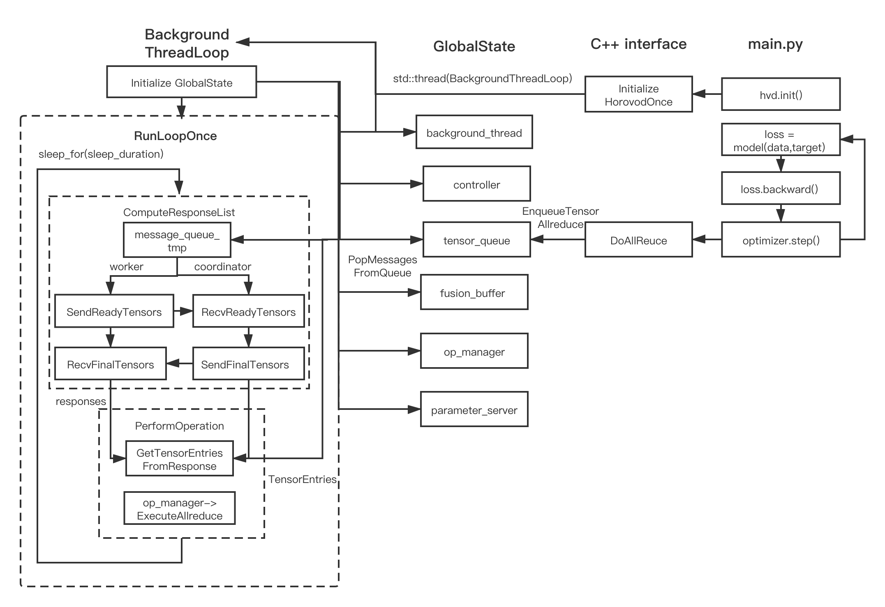

# Horovod 源码分析

​		最近有一些需求是跟分布式训练相关的，然后自己重新看了一下 horovod 的代码，感觉还是有一些不清晰的地方，所以尝试把自己的一些理解写下来，可能是更加好的实践，下面算是我自己的一些对 Horovod 源码的笔记，不能保证很准确，如果有错误或者模糊的地方也希望大家可以多多指正。

​		Horovod 是 Uber 开源的深度学习工具，它的发展吸取了Facebook "Training ImageNet In 1 Hour" 与百度 "Ring Allreduce" 的优点，在保证分布式训练性能的同时，兼顾了前端的简洁和对不同深度学习框架的支持，使用起来对开发人员比较的友好，算是分布式训练方向的标杆项目了。本文对 horovod 的介绍，会从比较底层的集合通信库开始讲起，因为我自己是做图像算法出身的，后面会从一个 pytorch 的 horovod 训练程序开始解析它的工作流程，所以这里可能会假设读者是有一些深度学习的背景知识，或者对 TensorFlow 和 Pytorch 等深度学习框架有一些了解。这里也顺道推荐一下大家读一下@gaocegege的这篇 [MPI，OpenMPI 与深度学习](https://zhuanlan.zhihu.com/p/158584571) 文章，感觉写得很精彩，深入浅出，我自己也受到了很多的启发。那下面我们就开始先说一下集合通信库，如果之前对相关的概念有所了解的话，这部分可以先跳过，直接从 pytorch 的例子开始看起。

## 集合通信库

集合通信库，这个词可能听起来会比较的陌生，不过如果我再提几个关键字，可能大家多少都会有所耳闻。资历比较老的是 MPI ([Message Passing Interface ](https://en.wikipedia.org/wiki/Message_Passing_Interface))，及其实现 [OpenMPI](https://www.open-mpi.org/) 和 [MPICH](https://www.mpich.org/)，年轻一点的会是 Nvidia 针对其显卡开源的 [NCCL](https://github.com/NVIDIA/nccl)，或者是 facebook 开源的 [gloo](https://github.com/facebookincubator/gloo)，或者是像华为针对其高性能硬件提供的HCCL，大体上都可以归入到集合通信库的类别。他们相同的地方是大体上会遵照 MPI 提供的接口规定，实现了包括点对点通信（SEND,RECV等），集合通信（ REDUCE，BROADCAST，ALLREDUCE等）等相关接口，然后根据自己硬件或者是系统的需要，在底层实现上进行了相应的改动，保证接口的稳定和性能。我们先大致地过一遍相关的一些概念。

#### 点对点通信 

Send / Recv



#### 集合通信：

Scatter / Gather 



Reduce/ Allreduce



Broadcast / All-gather 



这里在机器学习训练中使用比较多的是 **all-reduce**，场景类似在不同的 node 上跑不同 batch 的数据，然后更新梯度需要从各个汇总之后平均再回传到各自的 node 中。而这部分，有很多种实现的方式，比较直观和简单的是把所有的梯度都汇总到的某一个 node 上（如下图 **node d** 所示），然后再把汇总的信息重新分发到不同的 node 上 ，这样可以计算通信量，如下：对于 P 个节点，每个节点消息大小为 M，**node d** 节点的通信量为 2*(P-1)M，这里假设节点之间互联互通，带宽为B。



​												图源([腾讯机智团队分享--AllReduce算法的前世今生](https://zhuanlan.zhihu.com/p/79030485))

不过这种情况下，很容易导致 **node d**  会成为性能瓶颈，因为 **node d**  需要跟其他所有 node 通信所以它的通信量是其他节点的 P 倍。假设节点间的带宽还是一样，**node d** 完成所有通信所需要的时间是  2*(P-1)M/B。所以现在很多的集合通信框架不会使用这种方式，更多的是通过树状或者是环状(ring) 去实现 all-reduce。

如果只是做成树状的可以做成如下图所示，虽然传递的步数增多了，不过消除了node d 的通信瓶颈，完成所有的通信的时间大概是 2log_2N*(M/B)，随着节点数目 P 的增加，树形结构的效果会越来越明显。



​											图源([腾讯机智团队分享--AllReduce算法的前世今生](https://zhuanlan.zhihu.com/p/79030485))

业界用得最多一种优化的方式是，每次只传一部分，这部分是百度提出的 ring-allreduce 的方案，具体的介绍可以参考这篇博客[Bringing HPC Techniques to Deep Learning](https://andrew.gibiansky.com/blog/machine-learning/baidu-allreduce/)，这边就不赘述了。整体上就是每次不会像上面这样整份数据传递，而是一部分一部分传，优化后，所有节点需要传输的数据量的传输2(N−1)M/N 比较平均，所需要的时间可以大概是2(N−1)M/(NB)，horovod 也是基于这种 all-reduce 的形式实现的。

### 实践

#### Pytorch.distributed

上面聊了一些集合通信库相关的内容，可以尝试实践一下。如果是有深度学习背景的同学，我会假设你对 pytorch 比较熟悉，可以尝试使用 pytorch 自带的分布式工具包 [torch.distributed](https://pytorch.org/docs/stable/distributed.html)，进行一些概念性的尝试。

为了方便尝试，我这里提供了一个简单的 demo，大家如果安装了 gpu 版本的 pytorch >= 1.3，应该都可以尝试下面的例子。

distrbuted_test.py 尝试使用多进程模拟分布式（单机上可以跑）。

```python
import os
import torch
import torch.distributed as dist
import time
import argparse
from torch.multiprocessing import Process

parser = argparse.ArgumentParser(description='PyTorch MNIST Example')
parser.add_argument('-m',
                    '--mode',
                    type=str,
                    default='one_device',
                    metavar='N',
                    help='distribute mode, distributed/one_device')
parser.add_argument('-f',
                    '--function',
                    type=str,
                    default='p2p',
                    metavar='N',
                    help='function to run (p2p/all_reduce/gpu_all_reduce)')
parser.add_argument('-b',
                    '--backend',
                    type=str,
                    default="nccl",
                    metavar='N',
                    help='distribute backend (gloo/nccl)')


def init_process(rank, size, fn, backend='nccl'):
    """ Initialize the distributed environment. """
    os.environ['MASTER_ADDR'] = '127.0.0.1'
    os.environ['MASTER_PORT'] = '29500'
    dist.init_process_group(backend, rank=rank, world_size=size)
    fn(rank, size)


def run(rank, size):
    tensor = torch.zeros(1)
    print('Rank ', rank, ' has data before send/recv', tensor)
    if rank == 0:
        tensor += 1
        # Send the tensor to process 1
        dist.send(tensor=tensor, dst=1)
    else:
        # Receive tensor from process 0
        dist.recv(tensor=tensor, src=0)
    print('Rank ', rank, ' has data after send/recv', tensor)


def run_allreduce(rank, size):
    """ Simple reduce communication. """
    group = dist.new_group([0, 1])
    device = torch.device('cuda:%d' % rank)
    tensor = torch.ones(1).to(device)
    dist.all_reduce(tensor, op=dist.ReduceOp.SUM, group=group)
    print('Rank ', rank, ' has data ', tensor[0])


def run_multigpu_allreduce(rank, size):
    group = dist.new_group([0, 1])
    tensor_list = []
    for dev_idx in range(2):
        device = torch.device('cuda:%d' % (2 * rank + dev_idx))
        tensor = torch.ones(1).to(device)
        tensor_list.append(tensor)

    dist.all_reduce_multigpu(tensor_list)
    print('all_reduce_multigpu', tensor_list)
    dist.all_reduce(tensor_list[0], op=dist.ReduceOp.SUM, group=group)
    print('Rank ', rank, ' has data tensor[0]:', tensor_list[0],
          ", tensor[1]:", tensor_list[1])


if __name__ == "__main__":
    args = parser.parse_args()
    backend = args.backend
    if args.mode == "distributed" or os.environ.get('RANK',None):
        print("in distribute mode")
        if args.function == "all_reduce":
            function, size = run_allreduce, 2
        elif args.function == "gpu_all_reduce":
            function, size = run_multigpu_allreduce, 2
        else:
            function, size, backend = run, 2, "gloo"

        rank = int(os.environ['RANK'])
        p = Process(target=init_process, args=(rank, size, function, backend))
        p.start()
        p.join()
    else:
        print("in one device mode")
        if args.function == "all_reduce":
            function, size = run_allreduce, 2
        elif args.function == "gpu_all_reduce":
            function, size = run_multigpu_allreduce, 2
        else:
            function, size, backend = run, 2, "gloo"

        processes = []
        for rank in range(size):
            p = Process(target=init_process,
                        args=(rank, size, function, backend))
            p.start()
            processes.append(p)

        for p in processes:
            p.join()
```

可以简单地运行上面的例子：

#### send/recv

```shell
$ python3 distribute_test.py
# 输出如下：
in one device mode
Rank  0  has data before send/recv tensor([0.])
Rank  1  has data before send/recv tensor([0.])
Rank  0  has data after send/recv tensor([1.])
Rank  1  has data after send/recv tensor([1.])
```

上面是演示的是通过 pytorch 的 multiprocessing 包，模拟一次分布式的 send/recv 过程，这里是 rank0 的进程往 rank1 的进程发送一个 tensor，可以看到 rank 1 tensor 初始化为 0，是接收到 rank 0 的tensor 后变为 1 的。（注意：这里特别设置了 backend 为 gloo 是因为 nccl 不支持 point2point 的传输，具体不同 backend 支持什么形式的原语，参考[文档backend部分](https://pytorch.org/docs/stable/distributed.html) ）

#### all_reduce

```shell
$ python3 distribute_test.py -f all_reduce
# 输出如下：
in one device mode
Rank  0  has data  tensor(2., device='cuda:0')
Rank  1  has data  tensor(2., device='cuda:1')
# 对应函数 
def run_allreduce(rank, size):
    """ Simple reduce communication. """
    group = dist.new_group([0, 1])
    device = torch.device('cuda:%d' % rank)
    tensor = torch.ones(1).to(device)
    dist.all_reduce(tensor, op=dist.ReduceOp.SUM, group=group)
    print('Rank ', rank, ' has data ', tensor[0])
```

这里也很浅白，主要就是对两个进程上的 tensor 进行一次 allreduce，可以看到两个 rank 上的结果都为 2了。

#### gpu_all_reduce

```shell
$ python3 distribute_test.py -f gpu_all_reduce
# 输出如下：
#in one device mode
#all_reduce_multigpu [tensor([4.], device='cuda:2'), tensor([4.], device='cuda:3')]
#all_reduce_multigpu [tensor([4.], device='cuda:0'), tensor([4.], device='cuda:1')]
#Rank  0  has data tensor[0]: tensor([8.], device='cuda:0') , tensor[1]: tensor([4.], device='cuda:1')
#Rank  1  has data tensor[0]: tensor([8.], device='cuda:2') , tensor[1]: tensor([4.], device='cuda:3')
# 对应函数 
def run_multigpu_allreduce(rank, size):
    group = dist.new_group([0, 1])
    tensor_list = []
    for dev_idx in range(2):
        device = torch.device('cuda:%d' % (2 * rank + dev_idx))
        tensor = torch.ones(1).to(device)
        tensor_list.append(tensor)

    dist.all_reduce_multigpu(tensor_list)
    print('all_reduce_multigpu', tensor_list)
    dist.all_reduce(tensor_list[0], op=dist.ReduceOp.SUM, group=group)
    print('Rank ', rank, ' has data tensor[0]:', tensor_list[0],
          ", tensor[1]:", tensor_list[1])
```

这里演示的是尝试对不同进程下多个 gpu (这里是 4 个) 进行 reduce，具体逻辑就是：

- 对不同的进程分别把 tensor 初始化在不同的 gpu 上，rank0 初始化在 0，1 gpu 上，rank 1 在 2，3上。
- 进行一次 all_reduce_multigpu （这个函数跟 all_reduce 不同，是把不同的 node 上不同的gpu 上的tensor 都放到一个 list 中，进行reduce），这时所有 gpu 上的值都是4，作为对比，我们对 tensor_list[0] 的tensor 做一次all_reduce，得到的结果在 gpu 0,2 上的 tensor 进行了all_reduce 结果是 8，在 gpu 1,3 的 tensor 没有任何变化。

#### 多 terminal 尝试

在验证分布式逻辑的时候，其实我们不一定需要多台机子才可以，对一些不涉及网络性能的验证，可以尝试在一台机子上开多个 terminal 进行验证。可以使用上面的例子，在多个 terminal 下跑以下命令。

terminal 0 : 

```shell
RANK=0 python3 distribute_test.py -f gpu_all_reduce
# 输出如下
in distribute mode
all_reduce_multigpu [tensor([4.], device='cuda:0'), tensor([4.], device='cuda:1')]
Rank  0  has data tensor[0]: tensor([8.], device='cuda:0') , tensor[1]: tensor([4.], device='cuda:1')
```

terminal 1 : 

```shell
RANK=1 python3 distribute_test.py -f gpu_all_reduce
# 输出如下
in distribute mode
all_reduce_multigpu [tensor([4.], device='cuda:2'), tensor([4.], device='cuda:3')]
Rank  1  has data tensor[0]: tensor([8.], device='cuda:2') , tensor[1]: tensor([4.], device='cuda:3')
```

这里是通过本地机子上的回送地址进行模拟，结果是分别在不同的 terminal 呈现，当然可以用上面的demo，在多台机子上跑，不过需要修改一下 init_process 函数中的  os.environ['MASTER_ADDR'] = '127.0.0.1' 为 rank 0 机子的 IP，这里就不演示了。具体 pytorch distributed 工具相关的内容可以参考[官方博客](https://pytorch.org/tutorials/intermediate/dist_tuto.html)

**练习**： 如果大概理解了上面的一些集合通信的原语，可以尝试着用上面 pytorch 提供的 send/recv 尝试去实现一下上面的树状 allreduce。

#### MPI 

更深入的尝试，可以尝试了解一下 mpi 的知识，这个[mpi教程](https://mpitutorial.com/tutorials/) 算是写得比较系统的，大家可以参考一下来练习，特别是对底层不是很了解的同学，可以多看看 [Running an MPI cluster within a LAN](https://mpitutorial.com/tutorials/running-an-mpi-cluster-within-a-lan/) 的部分，实操一下通过 ssh 跑起一个分布式的 demo。集合通信库的基础大概先到这里，如果要深入的可以再去看看 [openMPI](https://github.com/open-mpi/ompi/blob/98afc838aa53da88cba339f6dcbab256806a5745/ompi/mca/coll/tuned/coll_tuned_allreduce_decision.c)，和 [nccl]() 的实现。


## Horvod 流程分析

下面我会以一个简单的 pytorch horovod 的 demo 尝试去理解一下 horovod 的工作机理，demo 如下（省略了一些不关键的代码段）。为了准确起见，我们是根据 horovod v0.20.3 的版本进行阅读的，如果是其他版本，可能会跟这里的内容有一些出入。

### pytorch demo

一般的 horovod 训练程序都会包含以下几个关键步骤：

1. hvd.init 对 horovod 初始化。
2. 初始化模型，数据集，优化器，初始化不同 node 的模型权重。
3. 使用 hvd.DistributedOptimizer 包装优化器。
4. 进入训练流程，进行优化迭代。

我们会着重介绍第 1 和 4 步，因为主要也是1，4步会跟 c++ 后端进行信息交换。

```python
import torch.backends.cudnn as cudnn
import torch.nn.functional as F
import torch.optim as optim
import torch.utils.data.distributed
from torchvision import models
import horovod.torch as hvd
import timeit
import numpy as np

... # some argparse

hvd.init()

# Set up standard model.
model = getattr(models, args.model)()

optimizer = optim.SGD(model.parameters(), lr=0.01 * lr_scaler)

# Horovod: (optional) compression algorithm.
compression = hvd.Compression.fp16 if args.fp16_allreduce else hvd.Compression.none

# Horovod: wrap optimizer with DistributedOptimizer.
optimizer = hvd.DistributedOptimizer(optimizer,
                                     named_parameters=model.named_parameters(),
                                     compression=compression,
                                     op=hvd.Adasum if args.use_adasum else hvd.Average)

# Horovod: broadcast parameters & optimizer state.
hvd.broadcast_parameters(model.state_dict(), root_rank=0)
hvd.broadcast_optimizer_state(optimizer, root_rank=0)

# Set up fixed fake data
data = torch.randn(args.batch_size, 3, 224, 224)
target = torch.LongTensor(args.batch_size).random_() % 1000
if args.cuda:
    data, target = data.cuda(), target.cuda()

def benchmark_step():
    optimizer.zero_grad()
    output = model(data)
    loss = F.cross_entropy(output, target)
    loss.backward()
    optimizer.step()
#... some log configuration
img_secs = []
for x in range(args.num_iters):
    time = timeit.timeit(benchmark_step, number=args.num_batches_per_iter)
    img_sec = args.batch_size * args.num_batches_per_iter / time
    img_secs.append(img_sec)

# Results
...
```

然后下图是我对 horovod 整体流程的梳理，把一些不是很关键的部分隐藏了，可能有一些细节的地方和实现有出入，不过我待会会有详细的说明。这里先解释一下，下面几个大的部分

-   **main.py**： 表示训练脚本，一般是 使用 horovod 提供的函数跟特定的训练框架相互合作完成分布式训练（下文称**前端**）
-   **C++ interface**：是指 horovod python 函数调用 C++ 的接口
-   **GlobalState**：在 horovod 中是一个全局变量，其中的元素可以供不同的线程访问，在加载 C++ 的代码时候就已经创建了，同时创建的还有各种 context（mpi_context, nccl_context, gpu_context）后面会提到，主要会在下图 backgroundThreadLoop 中完成 globalstate 不同元素初始化，比较重要的有 **controller** 管理总体通信控制流，**tensor_queue** 会处理从前端过来的通信需求（allreduce，broadcast 等）。
-   **BackgroundThreadLoop**：是训练过程中的后台线程，主要负责跟其他节点的通信，和处理前端过来的通信需求（request），会轮询调用 RunLoopOnce，不断查看 tensor_queue 中有没有需要通信的tensor，如果有跟其他节点同步更新，然后执行通信操作。



​										                                 **horovod 流程图**		

### 流程分析

我们下面以使用 mpi_controller 进行 allreduce 操作进行分析。

#### 1. hvd.init() -> InitializeHorovodOnce

首先，hvd.init() 会通过一系列的调用和配置最终调用 horovod/common/operations.cc 下的 InitializeHorovodOnce 函数，这个函数会根据加载的集合通讯库（mpi 或者 gloo）为 globalstate 创建对应的 controller，然后使用 BackgroundThreadLoop 启动一个后台线程。 

horovod/common/operations.cc #628

```c++
void InitializeHorovodOnce(const int* ranks, int nranks) {
// ... some envParse
#if HAVE_MPI
    // Enable mpi is it's used either i[n cpu data transfer or controller
    if (horovod_global.cpu_operation == LibType::MPI ||
        horovod_global.control_operation == LibType::MPI) {
      mpi_context.Enable();
    }
  	// 创建一个 MPIController 对象
    if (horovod_global.control_operation == LibType::MPI){
      horovod_global.controller.reset(new MPIController(
          horovod_global.response_cache,
          horovod_global.tensor_queue, horovod_global.timeline,
          horovod_global.parameter_manager, mpi_context));
      horovod_global.controller->SetRanks(ranks, nranks);
    }
#endif
#if HAVE_GLOO
	//...
#endif
    // Reset initialization flag
    horovod_global.initialization_done = false;
 		// 启动后台线程
    horovod_global.background_thread = std::thread(
        BackgroundThreadLoop, std::ref(horovod_global));
  }
  while (!horovod_global.initialization_done) {
    std::this_thread::sleep_for(std::chrono::milliseconds(1));
  }
}
```

#### 2.  BackgroundThreadLoop

BackgroundThreadLoop 会为 GlobalState 初始化一系列包括初始化 mpi_context， controller，的元素，然后轮询调用 RunLoopOnce，还有一些对 RunLoopOnce 结束后的后处理。

```c++
void BackgroundThreadLoop(HorovodGlobalState& state) {
#if HAVE_MPI
  // Initialize mpi context
  auto mpi_ctx_manager = MPIContextManager();
#endif
  // mpi_context 会根据前端和环境变量传过来的信息，创建 mpi 线程，和一些 mpiOps 
  mpi_context.Initialize(state.controller->GetRanks(), mpi_ctx_manager);
#endif
  // Initialize controller
  // 会同步不同 node 的 global_size, local_size, rank, is_coordinator 等信息
  state.controller->Initialize();
  // Set background thread affinity
  parse_and_set_affinity(std::getenv(HOROVOD_THREAD_AFFINITY), local_size, local_rank);

#if HAVE_GPU
  // 设置 gpu_context 的 stream 数目等初始化动作
  ... 
#endif
	// ...
  // 下面是设置 parameter_manager 这里为了节省篇幅直接给出，设置的语句，
  // 原来这里会读取对应的环境变量的，去设置 parameter_manager。
  // 后面也会有篇幅介绍 parameter_manager，这里先不展开。
  state.parameter_manager.SetTensorFusionThresholdBytes(64 * 1024 * 1024);
  state.parameter_manager.SetCycleTimeMs(5);
  state.parameter_manager.SetCacheEnabled(true);
  state.response_cache.set_capacity(
      (int)state.parameter_manager.CacheEnabled() * state.cache_capacity);
  state.parameter_manager.SetHierarchicalAllgather(value, true);
  state.parameter_manager.SetAutoTuning(true);
	... // 其他一些初始化设置
  // 设置op_manager，这里主要是注册不同的集合通信库的 ops
  //（ 如：NCCLAllreduce, MPI_GPUAllgather 等）
  op_manager.reset(CreateOperationManager(state));
  // 初始化完成
  state.initialization_done = true;
  // Iterate until shutdown.
  try {
    while (RunLoopOnce(state));
  } catch (const std::exception& ex) {
    LOG(ERROR) << "Horovod background loop uncaught exception: " << ex.what();
  }
... // 其他一些后处理函数
}
```

#### 3. Optimizer.step() -> DoAllReduce

这里我们先不急着看 RunLoopOnce 函数，先回到 InitializeHorovodOnce ，因为上面的 **initialization_done = True**，所以 InitializeHorovodOnce 可以退出了，就是前端的 hvd.init() 可以进行下一步了。这里 main.py 走完前向 loss = model(data,target)，后向逻辑 loss.backward()，调用 optimizer.step() 进行梯度同步。optimizer.step() 会通过一系列的调用和处理（如：compression 等操作）最终会调用 C++ interface 的 **DoAllReduce** 函数。

**DoAllReduce** 函数会调用 EnqueueTensorAllreduce 函数会把需要 reduce 的 tensor 组装成一个Request 往 GlobalState 的 tensor_queue 里面塞。这里注意每个 tensor 会创建对应 TensorTableEntry，用于保存tensor 的权重，message 主要是一些 元信息 metadata。然后就等后台线程去读取这些allreduce 的请求了。

```c++
Status EnqueueTensorAllreduce(std::shared_ptr<OpContext> context,
                              std::shared_ptr<Tensor> tensor,
                              std::shared_ptr<Tensor> output,
                              std::shared_ptr<ReadyEvent> ready_event,
                              const std::string name, const int device,
                              StatusCallback callback,
                              ReduceOp reduce_op,
                              double prescale_factor,
                              double postscale_factor) {
  Status status;
	... // some config
  Request message;
  message.set_request_rank(horovod_global.controller->GetRank());
  message.set_tensor_name(name);
  message.set_tensor_type(tensor->dtype());
  message.set_device(device);
  message.set_prescale_factor(prescale_factor);
  message.set_postscale_factor(postscale_factor);
  if (reduce_op == ReduceOp::ADASUM) {
    message.set_request_type(Request::ADASUM);
  } else {
    message.set_request_type(Request::ALLREDUCE);
  }
  for (int i = 0; i < tensor->shape().dims(); ++i) {
    message.add_tensor_shape((int64_t)tensor->shape().dim_size(i));
  }
  TensorTableEntry e;
  e.tensor_name = name;
  e.context = context;
  e.tensor = tensor;
  e.output = output;
  e.ready_event = ready_event;
  e.device = device;
  e.callback = callback;

  if (horovod_global.shut_down) {
    return SHUT_DOWN_ERROR;
  }
  status = horovod_global.tensor_queue.AddToTensorQueue(e, message);
  if (status.ok()) {
    LOG(TRACE, horovod_global.controller->GetRank()) << "Enqueued " << name;
  }
  return status;
}
```

#### 4. RunLoopOnce

回到后台线程 BackgroundThreadLoop，后面会轮询调用 RunLoopOnce。 RunLoopOnce会首先调用 **ComputeResponseList** 函数，其主要工作是同步不同 worker 之间的需要 allreduce 的 tensors，为后面 allreduce 的执行做好准备。

？？？为什么会在执行 tensor 的 allreduce 之前执行这样一步工作呢？而不是直接执行 allreduce 呢？我自己的猜测是，因为分布式训练是运行在不同的机子上的，因为 horovod 没有引入类似参数服务器（parameter server）的节点，而是采取 master-worker 的形式 进行 allreduce的。所以 allreduce 的时候必须确保所有的节点都是走到了同一句 allreduce 上，然后传输的 tensors 也要求是一致的，否则传输的 tensors 有可能没有匹配起来就执行allreduce，导致一些不可预知的错误。另外这部分引入了一些提高性能的 tricks，如对之前 reduce 过的 tensor 通过一个 bitmap 进行缓存，每次调用看一下是不是都是之前的 tensor，如果不是再 update 一下，不需要每次都全量更新。？？？（不是很确定）

**ComputeResponseList**  具体的流程是（可以对照上面流程图看）：

-   从自己进程的 GlobalState 读取 tensor_queue 的信息，如果有新的元素，会通过图中 popMessagesFromQueue pop 出来，然后经过一系列处理缓存到 **message_queue_tmp** 中。
-   当 worker 到达了前端 all_reduce 这句的时候，会用 **message_queue_tmp** 整理成一个 message_list通过下图的 **SendReadyTensors** 函数往主节点( coordinator ) 发送一个请求表明我打算reduce，然后会把准备 reduce 的 tensor 信息通过 message_list 迭代地送过去，最后有一个 Done 的请求
-    coordinator 会接收通过图中 **RecvReadyTensors** 这些 requests，然后保存在 ready_to_reduce 中，coordinator 会持续接收这些信息，直到获取的 Done 的数目等于 global_size。
-   coordinator 会找到所有准备好 reduce 的 tensors，通过 **SendFinalTensors** 返回一个 response 给所有的 worker，如果信息有误会返回一个 error，发送完成也会发送一个 Done。
-   worker 会通过 **RecvFinalTensors** 监听 response 的信息，整理出需要 reduce 的 tensor，当收到 Done，会尝试调用 performation 去进行 reduce 。
-   coordinator 和 worker 都会把同步的信息整理成一个 responses 的数组给到后面的 PerformOperation 操作。

这里说一下mpi是怎么实现的，就是对应的 coordinator 和 worker 会阻塞地到同一条指令：

SendReadyTensors 和 RecvReadyTensors  阻塞到 MPI_Gather，SendFinalTensors 和 RecvFinalTensors 到 MPI_Bcast ，可以这样分辨：如果是 coordinator 发送的就是 MPI_Bcast，如果是worker 发送的是 MPI_Gather。通信都是先同步需要通信message的大小 length，再同步message，代码如下：

horovod/common/mpi/mpi_controller.cc

```c++
void MPIController::SendReadyTensors(RequestList& message_list) {
  std::string encoded_message;
  RequestList::SerializeToString(message_list, encoded_message);
  int encoded_message_length = (int)encoded_message.length() + 1;
  // 先 gather 这个 message 的大小
  int ret_code = MPI_Gather(&encoded_message_length, 1, MPI_INT, nullptr, 1,
                            MPI_INT, RANK_ZERO, mpi_ctx_.mpi_comm);
  if (ret_code != MPI_SUCCESS) {
    throw std::runtime_error("MPI_Gather failed, see MPI output for details.");
  }
	// 再 gather 这个 message
  ret_code = MPI_Gatherv((void*)encoded_message.c_str(), encoded_message_length,
                         MPI_BYTE, nullptr, nullptr, nullptr, MPI_BYTE,
                         RANK_ZERO, mpi_ctx_.mpi_comm);
  ...
}

void MPIController::RecvReadyTensors(std::vector<std::string>& ready_to_reduce,std::vector<RequestList>& ready_list) {
  MPI_Gather(MPI_IN_PLACE, 1, MPI_INT, recvcounts, 1, MPI_INT, RANK_ZERO,
             mpi_ctx_.mpi_comm);
  ...
  MPI_Gatherv(nullptr, 0, MPI_BYTE, buffer, recvcounts, displcmnts, MPI_BYTE,
              RANK_ZERO, mpi_ctx_.mpi_comm);
  ...
}

void MPIController::RecvFinalTensors(ResponseList& response_list) {
  int msg_length;
  int ret_code =
      MPI_Bcast(&msg_length, 1, MPI_INT, RANK_ZERO, mpi_ctx_.mpi_comm);
  if (ret_code != MPI_SUCCESS) {
    throw std::runtime_error(
        "MPI_Broadcast failed, see MPI output for details.");
  }
  auto buffer = new uint8_t[msg_length];
  ret_code =
      MPI_Bcast(buffer, msg_length, MPI_BYTE, RANK_ZERO, mpi_ctx_.mpi_comm);
	...
}
```

#### 5. PerformOperation

从 ComputeResponseList 继续跑 RunLoopOnce， 不同 node 下面会根据前面 ComputeResponseList 返回的 response_list 对每个 response 轮询调用 PerformOperation 完成对应的 reduce 工作。

PerformOperation 流程：

horovod/common/operations.cc

```c++
void PerformOperation(Response response, HorovodGlobalState& state) {
  std::vector<TensorTableEntry> entries;
  auto& timeline = horovod_global.timeline;
  if (response.response_type() != Response::JOIN) {
    horovod_global.tensor_queue.GetTensorEntriesFromResponse(response, entries,
                                                             state.joined);
	... // 对数据预处理和 buffer 初始化
  Status status;
  // 执行 all_reduce 等操作
  try {
    status = op_manager->ExecuteOperation(entries, response);
  } catch (const std::exception& ex) {
    status = Status::UnknownError(ex.what());
  }
	... // 调用 callback 函数
}

```

-   PerformOperation 会从 horovod_global.tensor_queue 通过函数 GetTensorEntriesFromResponse 取出对应的 TensorEntry

-   如果还没初始化buffer，调用 horovod_global.fusion_buffer.InitializeBuffer 初始化

-   然后  status = op_manager->ExecuteOperation(entries, response); 

-   会调用不同的 op->Execute(entries, response);  

    下面以 **MPIAllreduce::Execute** 为例：

    horovod/common/ops/mpi_operations.cc

    ```c++
    Status MPIAllreduce::Execute(std::vector<TensorTableEntry>& entries, const Response& response) {
    	... // 一些变量声明
      // 把 tensor copy 到 buffer 中
      if (entries.size() > 1) {
        timeline.ActivityStartAll(entries, MEMCPY_IN_FUSION_BUFFER);
        MemcpyInFusionBuffer(entries, fused_input_data, buffer_data, buffer_len);
        timeline.ActivityEndAll(entries);
      } else {
        fused_input_data = first_entry.tensor->data();
        buffer_data = (void*) first_entry.output->data();
        buffer_len = (size_t) first_entry.output->size();
      }
    	// Do allreduce
      const void* sendbuf = entries.size() > 1 || fused_input_data == buffer_data
                            ? MPI_IN_PLACE : fused_input_data;
      int op = MPI_Allreduce(sendbuf, buffer_data,
                             (int) num_elements,
                             mpi_context_->GetMPIDataType(first_entry.tensor),
                             mpi_context_->GetMPISumOp(first_entry.tensor->dtype()),
                             mpi_context_->GetMPICommunicator(Communicator::GLOBAL));
      if (op != MPI_SUCCESS) {
        throw std::runtime_error("MPI_Allreduce failed, see MPI output for details.");
      }
      // Copy memory out of the fusion buffer.
      // 把 allreduce 后的 tensor copy 会 entries
      if (entries.size() > 1) {
        timeline.ActivityStartAll(entries, MEMCPY_OUT_FUSION_BUFFER);
        MemcpyOutFusionBuffer(buffer_data, entries);
        timeline.ActivityEndAll(entries);
      }
      return Status::OK();
    }
    ```

-   然后调用不同 entries 的 callback，这里 callback 一般是给前端作相应的。

#### 6. parameter_manager.update

完成上述步骤之后，如果设置了 state.parameter_manager.IsAutoTuning()，RunLoopOnce 还会调用相关的逻辑，调整传输的参数，然后返回 BackgroundThreadLoop 重新调用。重新调用时会睡一定时间再继续上述第 3 - 5 步的工作。

### 其他关键模块

上面只是介绍了 horovod 主流程工作原理，不过 horovod 还有其他一些模块协同主流程工作的，下面会对其中的一些我认为可以值得一说的模块说一下。

#### Parameter_manager

Parameter_manager 主要是 GlobalState 的一个用于管理一些调节 horovod 性能的参数的管理器，在 BackgroundThreadLoop 中跟其他的 GlobalState 的元素一同初始化，然后会读取下面这些对应的环境变量，然后进行设置。

**HOROVOD_FUSION_THRESHOLD** ：指传输数据切片的大小，默认是64M，如果切片太大，传输的时候就不能很好地 pipeline 传输，如果太小，一个 tensor 需要传输多次，增加 IO 的 overhead。

**HOROVOD_CYCLE_TIME** ：指 RunLoopOnce 的睡眠时长，默认是 5ms，我自己的猜测（还没进行验证）比较理想的睡眠时间应该是 RunLoopOnce 其余逻辑处理的时间 + HOROVOD_CYCLE_TIME 刚好等于一次前向传播和后向传播所用的时间，因为睡太久前端会在等 RunLoopOnce 睡醒；如果睡太短，不断地跑一次 RunLoopOnce，tensor_queue 也不会有新的元素，只是白跑。

**HOROVOD_CACHE_CAPACITY**：指 cache 的大小，这个可能跟 model 层数参数量相关了。

**HOROVOD_HIERARCHICAL_ALLGATHER**：是否使用分层的 allgather 的方式等

Parameter_manager 也提供了对这些参数自动调节的功能。通过 Parameter_manager.SetAutoTuning 进行设置，设置后会在初始的几个 batch 尝试不同的参数组合进行通信，后面会收敛到一组最优的参数值。

#### MPIContext

mpi_context 是在加载 C++ 的代码时候就已经创建了，同时创建的还有其他 context（ nccl_context, gpu_context），主要是维护一些节点上 mpi 通信的必要环境信息和设置，如：

-   3 个  MPI communicator，mpi_comm，local_comm，cross_comm 分别负责 horovod mpi 传输，节点内传输，和节点间分层传输（主要用于 hierarchical allreduce）。
-   mpi_float16_t ：horovod 主要以 float16 传输。
-   mpi_float16_sum： float16 对应的sum 操作。

在 horovod 使用 mpi 的时候，都会使用上面的 communicator 进行数据传输。

#### Tensorflow2 

TensorFlow2 前端对 horovod 的调用跟 pytorch 类似，只是因为 tensorflow 2 是通过 tape 等级制记录梯度的所以会有一些不同。

```python
hvd.init()
# Set up standard model.
model = getattr(applications, args.model)(weights=None)
opt = tf.optimizers.SGD(0.01)

data = tf.random.uniform([args.batch_size, 224, 224, 3])
target = tf.random.uniform([args.batch_size, 1], minval=0, maxval=999, dtype=tf.int64)


@tf.function
def benchmark_step(first_batch):
    # Horovod: (optional) compression algorithm.
    compression = hvd.Compression.fp16 if args.fp16_allreduce else hvd.Compression.none

    # Horovod: use DistributedGradientTape
    with tf.GradientTape() as tape:
        probs = model(data, training=True)
        loss = tf.losses.sparse_categorical_crossentropy(target, probs)

    # Horovod: add Horovod Distributed GradientTape.
    tape = hvd.DistributedGradientTape(tape, compression=compression)

    gradients = tape.gradient(loss, model.trainable_variables)
    opt.apply_gradients(zip(gradients, model.trainable_variables))
    if first_batch:
        hvd.broadcast_variables(model.variables, root_rank=0)
        hvd.broadcast_variables(opt.variables(), root_rank=0)
for x in range(args.num_iters):
  benchmark_step(first_batch=False)
```


- with tf.GradientTape() as tape 这一句会调用 horovod/tensorflow/\_\_init\_\_.py 中\_DistributedGradientTape 下 \_\_init\_\_ 函数注册 allreduce 的句柄（handle）

- 然后调用 gradients = tape.gradient(loss, model.trainable_variables) 会调用一系列的跳转最后会调用 tensorflow/mpi_ops.py 下的 _allreduce ，进而调用 MPI_LIB.horovod_allreduce 
- MPI_LIB.horovod_allreduce 在 horovod/tensorflow/mpi_ops.cc 中被 HorovodAllreduceOp 所注册，根据 TensorFlow 的 ops流程，会调用 ops.ComputeAsync，到这里会跟 pytorch 类似会调用 EnqueueTensorAllreduce 把对应的 tensor 和 ops 送到 GlobalState 的 tensor_queue 中。

```C++
class HorovodAllreduceOp : public AsyncOpKernel {
public:
  explicit HorovodAllreduceOp(OpKernelConstruction* context)
      : AsyncOpKernel(context) {
    OP_REQUIRES_OK(context, context->GetAttr("reduce_op", &reduce_op_));
    OP_REQUIRES_OK(context, context->GetAttr("prescale_factor", &prescale_factor_));
    OP_REQUIRES_OK(context, context->GetAttr("postscale_factor", &postscale_factor_));
    OP_REQUIRES_OK(context, context->GetAttr("ignore_name_scope", &ignore_name_scope_));
  }

  void ComputeAsync(OpKernelContext* context, DoneCallback done) override {
    OP_REQUIRES_OK_ASYNC(context, ConvertStatus(common::CheckInitialized()),
                         done);
		... // 一些变量验证，初始化
    auto enqueue_result = EnqueueTensorAllreduce(
        hvd_context, hvd_tensor, hvd_output, ready_event, node_name, device,
        [context, done](const common::Status& status) {
          context->SetStatus(ConvertStatus(status));
          done();
        }, reduce_op, (double) prescale_factor_, (double) postscale_factor_);
    OP_REQUIRES_OK_ASYNC(context, ConvertStatus(enqueue_result), done);
  }

private:
  int reduce_op_;
  // Using float since TF does not support double OP attributes
  float prescale_factor_;
  float postscale_factor_;
  bool ignore_name_scope_;
};

```


## 总结

horovod 的流程分析大概就是这样，没有特别复杂，代码的阅读体验也是比较好的，在主流程的关键函数都有比较清晰的注释。对于第三方开发者来说，horovod 本身已经用了很多提高性能的 tricks，可以 custom 优化的地方不多，一些可以动的参数，也已经提供了autotuning，直接使用就可以得到很好的性能。上面的分析也有很多是我自己阅读代码时候的一些思考可能不一定准确，如果有不准确或者模糊的地方，也希望大家可以多多斧正。
