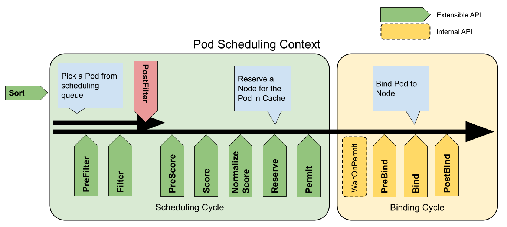
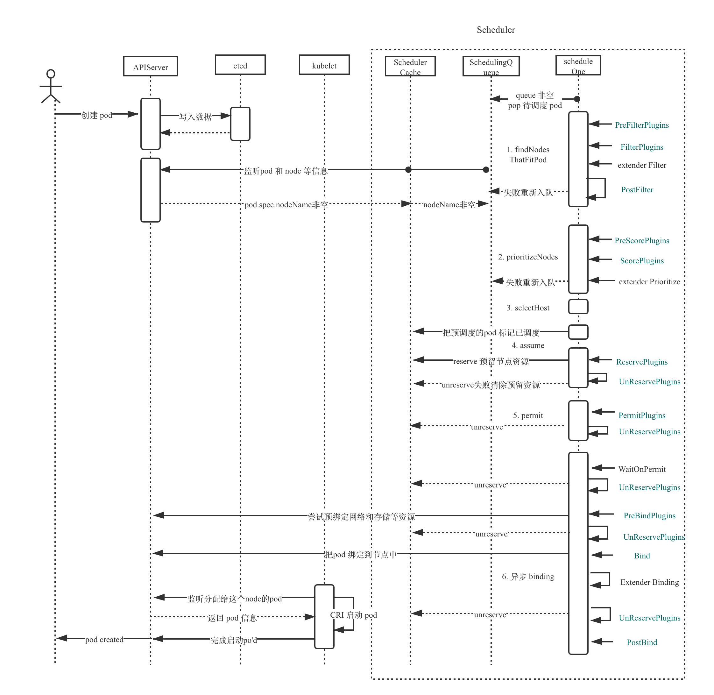

​		前面我们聊了 kubernetes 的默认调度器 default scheduler，其简单的调度逻辑，在 kubernetes 多个版本的迭代中一直保持稳定性能。不过随着 Kubernetes 部署的任务类型越来越多，原生的调度器已经不能应对多样的调度需求：比如机器学习、深度学习训练任务中对于多个 pod 协同调度的需求；大数据作业有原来自己的生态，需要在调度层面做相应的适配和迁移；原来高性能计算作业中，对一些高性能组件像 GPU、infiniteBand 网络、存储卷的动态资源的绑定需求等。另外，越来越多的 feature 也一直在被引入到 scheduler 的主干中，也使得 kube-scheduler 的维护变得越来越困难。 

​		所以，kubernetes 社区在 v1.15 的版本中开始逐步引入 scheduler framework 为 kube-scheduler 带来更多的可扩展性，把之前很多的调度逻辑都通过 plugin 的形式重新改造，同时引入了更多位点方便定制 scheduler。本文会先讨论 scheduler 的原理，然后通过分析不同的plugin 的代码实现来更加具体的了解 scheduler framework。

## Scheduler Framework 原理

scheduler framework 最早是通过 kubernetes enhancements 的 [624-scheduling-framework](https://github.com/kubernetes/enhancements/tree/master/keps/sig-scheduling/624-scheduling-framework) 提案引入的，主要是为了实现以下几个目标：

- 提供更多自定位位点和更多的可扩展性。
- 简化scheduler 的核心代码，把部分 features 的实现迁移到 plugin 中。
- 提供一种高效的机制，确认 plugins 的结果或者启用 plugins 的结果，并对发生的错误进行处理。
- 支持 out-of-tree 的扩展等。

为此 scheduler framework 定义了多个扩展点如下：

上图的调度周期（scheduling cycle）和绑定周期（binding cycle）具体的逻辑在我们之前的文章中已经有所讲述了，不过为了讲述方便我们也回顾一下，kube-scheduler 具体的调度过程。

- 当用户创建 pod 的时候，apiserver 接受请求把数据写入到 etcd
- scheduler 的 informer 会监听到 pod 创建的信息，然后把事件同步给 scheudulingQueue （如果是已经调度过的pod，如：被删除的deployment pod 会同步到 schedulerCache），进入 queue 的 pod 会通过 **Sort** 的 plugins 对pod 的优先级进行排序，优先级高的放在前面。
- scheduler 的主逻辑（scheduleOne）会不断地从 schedulingQueue 弹出未调度的 pod
- 然后调用 **PrefilterPlugins** 对 pod 进行预筛选
- 然后调用 **FilterPlugins** 对 nodes 的信息进行筛选，主要看一下资源是否足够等
- 然后会把前面过滤的 nodes 塞给 prioritizeNodes 函数主要会给前面过滤的 nodes 一个优先级。期间会调用 **PreScorePlugins** 和 **ScorePlugins** 用于计算每个plugins 对每个节点的分数，算分的时候会调用 **NormalizeScore** 用于对分数归一化。
- 通过selectHost进行汇总和选出合适的节点
- 如果没有选出合适的节点，会调用 **PostFilterPlugins** 主要是选主失败的时候调用，会运行抢占驱逐等逻辑
- 如果调度成功会通过 assume 告诉 cache pod 已经调度，之后会调用 **ReservePlugins** 也会告诉 cache 要预留 pod 调度需要的资源。通常设置了 reservePlugins 就需要设置 **UnReservePlugins** 保证如果后续的步骤失败了，可以释放前面预调度预留的资源。
- 然后触发 **PermitPlugins**，只要有一个 permit 不满足，就会在后面的绑定的时候停留在 waitOnPermit 中，直到 permit 的条件满足或者超时
- 然后进入异步调度逻辑，会调用 **PreBindPlugins** 主要是对所需的网络，存储等资源进行预绑定。
- 然后进入bind函数，会调用 **BindPlugins**， 不过目前主要还是默认的绑定方式。
- 如果绑定成功会调用 **PostBindPlugins** 对绑定现场进行清理。

上面就是整一个调度流程的步骤，也已经把所有 plugin 的位点给出，下面我们会看一下 plugin 具体的实现结构。