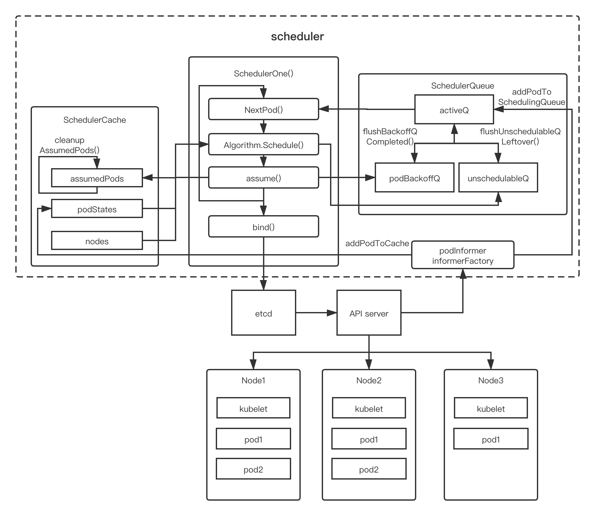

# kube-scheduler

​		kube-scheduler 是 Kubernetes 的核心组件之一，主要根据一些调度算法，将没有调度将 [Pod](https://kubernetes.io/docs/concepts/workloads/pods/pod-overview/) 放置到合适的 [Node](https://kubernetes.io/zh/docs/concepts/architecture/nodes/) 上，然后对应 Node 上的 [Kubelet](https://kubernetes.io/docs/reference/generated/kubelet) 才能够运行这些 pod。可以认为 scheduler 就是集群负载的管理者，针对用户或者组件创建的 pod 的负载，为其在集群中找到一个合适的节点，然后让对应节点的 kubelet 服务进程将其运行起来。这篇文章的结构大概是这样的，我们先会从宏观上去看一下 scheduler 的工作原理，然后到每一个部分看一下对应关键代码的实现，其中尝试去褚穿插一些，我了解到的 scheduler 的版本迭代的过程，然后是一些思考和展望。为了方便复现和讲解，下面对kube-scheduler 代码的分析使用的是 kubernetes 的 v1.19.1 的版本的代码，如果是谈到其他版本也会在其中标注起来。

## 工作原理

### 调度器架构 

调度器主要的组件如下：

pkg/scheduler/scheduler.go

```go
type Scheduler struct {
   // 主要是缓存现在集群调度的状态，如上图所示，会保留集群中所有已调度 pod 的状态，node 的状态，和assumedpod，防止 pod 被重新调度。
   SchedulerCache internalcache.Cache
	 // Algorithm 需要实现 Schedule 的方法，输入一个 pod 可以找到合适 node。默认是通过   
   // pkg/scheduler/core/generic_scheduler.go 的 generic_scheduler 实现的。
   Algorithm core.ScheduleAlgorithm
	 // 获取下一个 pod
   NextPod func() *framework.QueuedPodInfo

   // Error is called if there is an error. It is passed the pod in
   // question, and the error
   Error func(*framework.QueuedPodInfo, error)

   // Close this to shut down the scheduler.
   StopEverything <-chan struct{}

   // SchedulingQueue 会保留准备调度的 pod 的队列。
   SchedulingQueue internalqueue.SchedulingQueue

   // 所有的 plugin 都会以 profile 的形式供默认调度器使用
   Profiles profile.Map

   scheduledPodsHasSynced func() bool
	 // 用于和 api-server 的通信
   client clientset.Interface
}
```



调度器框架如上图所示，调度主要的工作是 watch 有没有没有调度的 pod，如果有会尝试找一个合适的 node，然后把 pod 和 node 的 binding 写回给 apiserver。这里只拎出Algorithm，SchedulerCache，SchedulingQueue 来介绍，Profiles 主要是跟 plugins 相关的组件，后面会找时间介绍。

### 工作流程

-   首先 SchedulerCache 会通过 Informer 读取现在集群的 node, pod 的状态，缓存在内存中。同时监控集群资源状态（如果有创建 node 等事件发生也会及时同步） ，SchedulingQueue 同时也会运行两个进程，分别定时把 BackoffQ 和 UnschedulabelQ 的 Pod 刷进去 activeQ 中。
-   如果有创建 pod 等事件的发生，如果 pod 没有被调度过，会直接进入  SchedulingQueue 的 activeQ 队列中。
-   然后 scheduler 会轮询地执行 scheduleOne 的流程
    -   通过 NextPod 接口从 activeQ 中读取入队 pod 的信息
    -   然后通过 Algorithm (generic_scheduler) 为这个 pod 尝试找到一个合适 node 进行调度，如果这一步失败了，如果设置了可以抢占会触发抢占，不过这里先不涉及，这样这个 pod 会进入 UnschedulabelQ 的队列中。
    -   如果调度成功会触发一次 assume，主要是在 cache 中记录这个 pod 为已经调度了，这样下次调度的时候就不会重新调度一次这个 pod。因为 assume 之后 scheduleOne 会起一个 goroutine 来负责 binding 的工作。scheduleOne 会跑下一个循环，如果没有 assume，可能导致 node 的资源会被重新使用等问题。
    -   binding 会通知 apiserver pod 和 node 的 binding 已经创建，让 api-server 通知 node 的 kubelet 去配置相应的环境，如（网络，存储等），如果 bind 成功。schedulerCache 会有一个进程 cleanupAssumedPods 不断地看这个pod 是否已经 binding 完成或者超时了，如果 binding 完成会去除这个 assume 的标志。


## 源码分析

这里我会尝试以一种尽可能详尽（啰嗦）的方式去介绍 kube-scheduler 的源码实现，中间会穿插一下，我对 scheduler 版本迭代的一些理解。我们会从  cmd/kube-scheduler/app/server.go 开始说起。

### etup

在 cmd/kube-scheduler/app/server.go 中，会通过 cobra 命令行定义 scheduler 的启动命令，最终是运行 cmd/kube-scheduler/app/server.go 中 runCommand 定义的逻辑，调用 Setup 函数，如下：

```go
// Setup creates a completed config and a scheduler based on the command args and options
func Setup(ctx context.Context, opts *options.Options, outOfTreeRegistryOptions ...Option) (*schedulerserverconfig.CompletedConfig, *scheduler.Scheduler, error) {
   if errs := opts.Validate(); len(errs) > 0 {
      return nil, nil, utilerrors.NewAggregate(errs)
   }
   // 初始化 client, EventBroadcaster,PodInformer,InformerFactory 并通过 config 回传。
   c, err := opts.Config()
   if err != nil {
      return nil, nil, err
   }

   // Get the completed config
   cc := c.Complete()

   outOfTreeRegistry := make(runtime.Registry)
   for _, option := range outOfTreeRegistryOptions {
      if err := option(outOfTreeRegistry); err != nil {
         return nil, nil, err
      }
   }

   recorderFactory := getRecorderFactory(&cc)
   // Create the scheduler.
   sched, err := scheduler.New(cc.Client,
      cc.InformerFactory,
      cc.PodInformer,
      recorderFactory,
      ctx.Done(),
      scheduler.WithProfiles(cc.ComponentConfig.Profiles...),
      scheduler.WithAlgorithmSource(cc.ComponentConfig.AlgorithmSource),
      scheduler.WithPercentageOfNodesToScore(cc.ComponentConfig.PercentageOfNodesToScore),
      scheduler.WithFrameworkOutOfTreeRegistry(outOfTreeRegistry),
      scheduler.WithPodMaxBackoffSeconds(cc.ComponentConfig.PodMaxBackoffSeconds),
      scheduler.WithPodInitialBackoffSeconds(cc.ComponentConfig.PodInitialBackoffSeconds),
      scheduler.WithExtenders(cc.ComponentConfig.Extenders...),
   )
   if err != nil {
      return nil, nil, err
   }

   return &cc, sched, nil
}
```

-   opt.Config() 主要做了下面几件事：
    1.  createClients 启动 clientset
    2.  events.NewEventBroadcasterAdapter(eventClient) 启动  EventBroadcaster
    3.  c.InformerFactory = informers.NewSharedInformerFactory(client, 0) 启动 informer

scheduler.New 启动 scheduler 实例：

pkg/scheduler/scheduler.go

```go
// New returns a Scheduler
func New(client clientset.Interface,
   informerFactory informers.SharedInformerFactory,
   podInformer coreinformers.PodInformer,
   recorderFactory profile.RecorderFactory,
   stopCh <-chan struct{},
   opts ...Option) (*Scheduler, error) {

	 ... // some config
   // 初始化 schedulerCache
   schedulerCache := internalcache.New(30*time.Second, stopEverything)
	 // 注册 intree 的 plugins
   registry := frameworkplugins.NewInTreeRegistry()
   if err := registry.Merge(options.frameworkOutOfTreeRegistry); err != nil {
      return nil, err
   }
	 // 初始化 snapshot
   snapshot := internalcache.NewEmptySnapshot()

   configurator := &Configurator{
      client:                   client,
      recorderFactory:          recorderFactory,
      informerFactory:          informerFactory,
      podInformer:              podInformer,
      schedulerCache:           schedulerCache,
      StopEverything:           stopEverything,
      percentageOfNodesToScore: options.percentageOfNodesToScore,
      podInitialBackoffSeconds: options.podInitialBackoffSeconds,
      podMaxBackoffSeconds:     options.podMaxBackoffSeconds,
      profiles:                 append([]schedulerapi.KubeSchedulerProfile(nil), options.profiles...),
      registry:                 registry,
      nodeInfoSnapshot:         snapshot,
      extenders:                options.extenders,
      frameworkCapturer:        options.frameworkCapturer,
   }

   metrics.Register()

   var sched *Scheduler
   // 通过上面 configurator 创建 scheduler(sched) 
   // 可以通过 policy 或者 provider 创建
   ...
   sched.StopEverything = stopEverything
   sched.client = client
   sched.scheduledPodsHasSynced = podInformer.Informer().HasSynced

   addAllEventHandlers(sched, informerFactory, podInformer)
   return sched, nil
}

```

1. schedulerCache = internalcache.New(30*time.Second, stopEverything) 启动 scheduler 的缓存

2. registry := frameworkplugins.NewInTreeRegistry() 会读取所有 intree 的 plugins 注册掉，譬如：注册interpodaffinity 的调度算法，这种 plugin 的注册方式是通过 v1.15 开始引入的 scheduler  framework 实现的。

3. 初始化 Snapshot，初始化一个 map 保存 node 信息，是用在 Algorithm.Schedule 的过程中的，主要是保留一份 cache 的备份

4. 通过上面 configurator 创建 scheduler(sched) ，可以通过  configurator.createFromConfig(\*policy\)
    或者 configurator.createFromProvider(\*source.Provider) 来进行，不过无论使用哪种方式创建都会调用 configurator.create() 函数：

    pkg/scheduler/core/generic_scheduler.go

    ```go
    // create a scheduler from a set of registered plugins.
    func (c *Configurator) create() (*Scheduler, error) {
       var extenders []framework.Extender
       var ignoredExtendedResources []string
       if len(c.extenders) != 0 {
         ... // 如果有 extenders
       }
       if len(ignoredExtendedResources) > 0 {
         ... // 对 ignoredExtendedResources 有一些处理 
       }
    	 ...
       // 初始化 profiles
       profiles, err := profile.NewMap(c.profiles, c.buildFramework, c.recorderFactory,
          frameworkruntime.WithPodNominator(nominator))
       // 初始化队列优先级函数
       lessFn := profiles[c.profiles[0].SchedulerName].Framework.QueueSortFunc()
       // 初始化调度队列，需要优先级函数，和定义 backoffQ,UnScheduableQ 刷回 activeQ 的周期参数 
       podQueue := internalqueue.NewSchedulingQueue(
          lessFn,
          internalqueue.WithPodInitialBackoffDuration(time.Duration(c.podInitialBackoffSeconds)*time.Second),
          internalqueue.WithPodMaxBackoffDuration(time.Duration(c.podMaxBackoffSeconds)*time.Second),
          internalqueue.WithPodNominator(nominator),
       )
       // 使用 NewGenericScheduler 初始化 Algorithm
       algo := core.NewGenericScheduler(
          c.schedulerCache,
          c.nodeInfoSnapshot,
          extenders,
          c.informerFactory.Core().V1().PersistentVolumeClaims().Lister(),
          c.disablePreemption,
          c.percentageOfNodesToScore,
       )
    
       return &Scheduler{
          SchedulerCache:  c.schedulerCache,
          Algorithm:       algo,
          Profiles:        profiles,
          NextPod:         internalqueue.MakeNextPodFunc(podQueue),
          Error:           MakeDefaultErrorFunc(c.client, c.informerFactory.Core().V1().Pods().Lister(), podQueue, c.schedulerCache),
          StopEverything:  c.StopEverything,
          SchedulingQueue: podQueue,
       }, nil
    }
    ```

5. addAllEventHandlers 为 scheduler 提供 eventHandler，如上面架构图所示：event 的接收者主要有两个，SchedulerCache 和 SchedulingQueue，前者是为了跟踪集群的资源和已调度 Pod 的状态（addNodeToCache，addPodToCache），后者主要是给没有调度的 Pod 入队到 activeQ 中（addPodToSchedulingQueue）。这里重点看一下，如果是未调度的pod，会经过event 的过滤器，其中 assignedPod(t) 会看 pod.Spec.NodeName 判断 pod 是不是已经调度或者 assume 了，responsibleForPod(t, sched.Profiles) 会看 pod.Spec.SchedulerName 看一下调度器名字是不是本调度器。

    pkg/scheduler/eventhandlers.go 

    ```go
    // addAllEventHandlers is a helper function used in tests and in Scheduler
    // to add event handlers for various informers.
    func addAllEventHandlers(
       sched *Scheduler,
       informerFactory informers.SharedInformerFactory,
       podInformer coreinformers.PodInformer,
    ) {
       // scheduled pod cache
       podInformer.Informer().AddEventHandler(
          cache.FilteringResourceEventHandler{
             FilterFunc: func(obj interface{}) bool {
                switch t := obj.(type) {
                case *v1.Pod:
                   return assignedPod(t)
                case cache.DeletedFinalStateUnknown:
                   ...
                default:
                   ...
                }
             },
             Handler: cache.ResourceEventHandlerFuncs{
                AddFunc:    sched.addPodToCache,
                UpdateFunc: sched.updatePodInCache,
                DeleteFunc: sched.deletePodFromCache,
             },
          },
       )
       // unscheduled pod queue
       podInformer.Informer().AddEventHandler(
          cache.FilteringResourceEventHandler{
             FilterFunc: func(obj interface{}) bool {
                switch t := obj.(type) {
                case *v1.Pod:
                   return !assignedPod(t) && responsibleForPod(t, sched.Profiles)
                case cache.DeletedFinalStateUnknown:
                   ...
                default:
                   ...
                }
             },
             Handler: cache.ResourceEventHandlerFuncs{
                AddFunc:    sched.addPodToSchedulingQueue,
                UpdateFunc: sched.updatePodInSchedulingQueue,
                DeleteFunc: sched.deletePodFromSchedulingQueue,
             },
          },
       )
    
       informerFactory.Core().V1().Nodes().Informer().AddEventHandler(
          cache.ResourceEventHandlerFuncs{
             AddFunc:    sched.addNodeToCache,
             UpdateFunc: sched.updateNodeInCache,
             DeleteFunc: sched.deleteNodeFromCache,
          },
       )
       ... 
       informerFactory.Core().V1().PersistentVolumes().Informer().AddEventHandler(...)   informerFactory.Core().V1().PersistentVolumeClaims().Informer().AddEventHandler(...)
       informerFactory.Core().V1().Services().Informer().AddEventHandler(...)
      informerFactory.Storage().V1().StorageClasses().Informer().AddEventHandler(...)
    }
    
    // assignedPod selects pods that are assigned (scheduled and running).
    func assignedPod(pod *v1.Pod) bool {
    	return len(pod.Spec.NodeName) != 0
    }
    // 看一下是不是我们负责的
    func responsibleForPod(pod *v1.Pod, profiles profile.Map) bool {
    	return profiles.HandlesSchedulerName(pod.Spec.SchedulerName)
    }
    ```

### Run

runCommand 在执行完 Setup() 之后会调用Run()，此时 scheduler 已经初始化好了。 

cmd/kube-scheduler/app/server.go

```go
// Run executes the scheduler based on the given configuration. It only returns on error or when context is done.
func Run(ctx context.Context, cc *schedulerserverconfig.CompletedConfig, sched *scheduler.Scheduler) error {
   ... // some config

   // Prepare the event broadcaster.
   cc.EventBroadcaster.StartRecordingToSink(ctx.Done())

   ... // setup 健康检查的服务器.

   // Start all informers.
   go cc.PodInformer.Informer().Run(ctx.Done())
   cc.InformerFactory.Start(ctx.Done())

   // Wait for all caches to sync before scheduling.
   cc.InformerFactory.WaitForCacheSync(ctx.Done())

   // 选主逻辑
   if cc.LeaderElection != nil {
     ...
   }
  
   sched.Run(ctx)
   return fmt.Errorf("finished without leader elect")
}
```


```go
func (sched *Scheduler) Run(ctx context.Context) {
   if !cache.WaitForCacheSync(ctx.Done(), sched.scheduledPodsHasSynced) {
      return
   }
   sched.SchedulingQueue.Run()
   wait.UntilWithContext(ctx, sched.scheduleOne, 0)
   sched.SchedulingQueue.Close()
}
```

SchedulingQueue.Run() 会起两个 goroutine ，

- flushBackoffQCompleted 主要负责把所有 backoff 计时完毕（duration 会因为失败变长）的 pod 往 activeQ刷。
- flushUnschedulableQLeftover 把所有在 unschedulableQ 的 pod  计时unschedulableQTimeInterval 完毕后送去 activeQ  

#### scheduleOne

scheduleOne 是调度的主逻辑，下面会把 scheduleOne 的逻辑分为两部分，第一部分是调度部分，第二部分是对调度结果进行处理部分（包括抢占和绑定等部分）。

##### Part1

pkg/scheduler/scheduler.go 

```go
// scheduleOne does the entire scheduling workflow for a single pod.  It is serialized on the scheduling algorithm's host fitting.
func (sched *Scheduler) scheduleOne(ctx context.Context) {
   podInfo := sched.NextPod()
   // pod could be nil when schedulerQueue is closed
   if podInfo == nil || podInfo.Pod == nil {
      return
   }
   pod := podInfo.Pod
   prof, err := sched.profileForPod(pod)
	 // 根据 prof 确定是不是要 skip 这个 pod
   ...
   // Synchronously attempt to find a fit for the pod.
   start := time.Now()
   state := framework.NewCycleState()
   state.SetRecordPluginMetrics(rand.Intn(100) < pluginMetricsSamplePercent)
   schedulingCycleCtx, cancel := context.WithCancel(ctx)
   defer cancel()
   // 调度逻辑
   scheduleResult, err := sched.Algorithm.Schedule(schedulingCycleCtx, prof, state, pod)
   ... // 下面是 Part2

```

ScheudleOne 第一部分的逻辑如上：

 1.    首先 sched.NextPod() 会调用 scheduler 的 Pop 接口，直接 PriorityQueue.activeQ.Pop()

 2.    查看 profile 是否负责这个 pod，Profile, err := sched.profileForPod(pod) 【之前版本是 frameworkForPod】 会查看 pod 的 schedulername

 3.    skipPodSchedule 有两种情况 skip，(1) pod 正在被删除，(2) pod 被 assumed

 4.    scheduleResult, err := sched.Algorithm.Schedule这里会根据提供的算法调用 genericScheduler.Schedule 完成调度，这里需要展开一下：

       pkg/scheduler/core/generic_scheduler.go

       ```go
       func (g *genericScheduler) Schedule(ctx context.Context, prof *profile.Profile, state *framework.CycleState, pod *v1.Pod) (result ScheduleResult, err error) {
          ... // some preprocess
          if err := g.snapshot(); err != nil {
             return result, err
          }
          trace.Step("Snapshotting scheduler cache and node infos done")
       
          if g.nodeInfoSnapshot.NumNodes() == 0 {
             return result, ErrNoNodesAvailable
          }
       
          startPredicateEvalTime := time.Now()
          // 对 node 进行预选
          feasibleNodes, filteredNodesStatuses, err := g.findNodesThatFitPod(ctx, prof, state, pod)
          if err != nil {
             return result, err
          }
          trace.Step("Computing predicates done")
       
          if len(feasibleNodes) == 0 {
             return result, &FitError{
                Pod:                   pod,
                NumAllNodes:           g.nodeInfoSnapshot.NumNodes(),
                FilteredNodesStatuses: filteredNodesStatuses,
             }
          }
          ... // some metrics
          // 如果只有一个 node 合适就不会进入优选环节
          if len(feasibleNodes) == 1 {
       	 		... // some metrics
             return ScheduleResult{
                SuggestedHost:  feasibleNodes[0].Name,
                EvaluatedNodes: 1 + len(filteredNodesStatuses),
                FeasibleNodes:  1,
             }, nil
          }
          // 对 node 进行优选
          priorityList, err := g.prioritizeNodes(ctx, prof, state, pod, feasibleNodes)
          if err != nil {
             return result, err
          }
       	 ... // some metrics
          host, err := g.selectHost(priorityList)
          trace.Step("Prioritizing done")
       
          return ScheduleResult{
             SuggestedHost:  host,
             EvaluatedNodes: len(feasibleNodes) + len(filteredNodesStatuses),
             FeasibleNodes:  len(feasibleNodes),
          }, err
       }
       ```

       1.  生成一个这个时刻的 snapshot，主要是这个时刻的 nodeInfo map 生成一份快照

       2.  findNodesThatFitPod 找什么 node 适合这个 pod

           ```go
           func (g *genericScheduler) findNodesThatFitPod(ctx context.Context, prof *profile.Profile, state *framework.CycleState, pod *v1.Pod) ([]*v1.Node, framework.NodeToStatusMap, error) {
              filteredNodesStatuses := make(framework.NodeToStatusMap)
              // Run "prefilter" plugins.
              s := prof.RunPreFilterPlugins(ctx, state, pod)
              ... //错误处理 
              feasibleNodes, err := g.findNodesThatPassFilters(ctx, prof, state, pod, filteredNodesStatuses)
              if err != nil {
                 return nil, nil, err
              }
              feasibleNodes, err = g.findNodesThatPassExtenders(pod, feasibleNodes, filteredNodesStatuses)
              if err != nil {
                 return nil, nil, err
              }
              return feasibleNodes, filteredNodesStatuses, nil
           }
           ```

           1.  prof.RunPreFilterPlugins(ctx, state, pod) 先进行预过滤，主要对 pod 进行。

           2.  g.findNodesThatPassFilters(ctx, prof, state, pod, filteredNodesStatuses) 这部分会问这个 pod 调度到该 node 合适吗，主要会跟 node 中的 pod 进行亲和性检查等过滤性操作，
               - 这里会定义 numNodesToFind := g.numFeasibleNodesToFind(int32(len(allNodes))) 确定遍历 node 的数目，如果集群太大，遍历所有的 node 是比较耗时的，默认是如果 nodes 数目小于100，会遍历所有 node，如果太多会取百分比。 
               - 然后  会通过 parallelize 提供的并发接口调用 checkNode，一般并发数量为 16。checkNode 会调用 PodPassesFiltersOnNode 主要是看一下pod 跟在 node 里面的pod 有没有不兼容的关系，查一下优先级是不是equal 或者有比上面的pod 大，如果可以抢占？
               - checkNode 会返回不同node 的适不适合的信息，如果适合信息放在一个list 中 feasibleNodes[length-1] = nodeInfo.Node()，如果不适合在 statuses[nodeInfo.Node().Name] = status 登记错误信息

           3.  findNodesThatPassExtenders 会遍历不同 extender，针对不同的资源，Filter(pod, feasibleNodes) 主要也是用户写的custom filter，也是返回 feasibleNodes（ []v1.Node）。

       3.  前面 findNodesThatFitPod 返回了合适 []v1.Node，g.prioritizeNodes 会根据一些优先级算法计算不同node的得分给出这些node 的排序。

       4.  然后 host, err := g.selectHost(priorityList) 会根据前面 findNodesThatFitPod 的排序结果选择一个合适的pod。

##### part2

继续 scheduleOne 的逻辑：

-   如果前面调度失败，会进入下面的错误逻辑，如果设置了PostFilterPlugins，会调用 prof.RunPostFilterPlugins。这个是引入 scheduler framework 之后的形式，之前的抢占（引用连接）。
-   如果前面 schedule 的 sched.Algorithm.Schedule 调度算法调度成功，scheduleResult 返回一个建议调度的node，然后调用 sched.assume，这里主要是在 cache 中记录这个 pod 为已经调度了，这样下次调度的时候就不会重新调度一次这个 pod。
-   然后会调用，RunReservePluginsReserve，RunPermitPlugins，这些 plugins 设置的位点，我们假设没有plugins 设置了先跳过。
-   就会进入绑定的逻辑（bind）

```go
   scheduleResult, err := sched.Algorithm.Schedule(schedulingCycleCtx, prof, state, pod)
   if err != nil {
      nominatedNode := ""
      if fitError, ok := err.(*core.FitError); ok {
         if !prof.HasPostFilterPlugins() {
            klog.V(3).Infof("No PostFilter plugins are registered, so no preemption will be performed.")
         } else {
            // Run PostFilter plugins to try to make the pod schedulable in a future scheduling cycle.
            result, status := prof.RunPostFilterPlugins(ctx, state, pod, fitError.FilteredNodesStatuses)
            ... // 抢占后处理
         }
				 ... // 其他 error 情况
      }
      // 记录 SchedulingFailure，pod 入队 UnschedulableQ
      sched.recordSchedulingFailure(prof, podInfo, err, v1.PodReasonUnschedulable, nominatedNode)
      return
   }
   metrics.SchedulingAlgorithmLatency.Observe(metrics.SinceInSeconds(start))
   // Tell the cache to assume that a pod now is running on a given node, even though it hasn't been bound yet.
   // This allows us to keep scheduling without waiting on binding to occur.
   assumedPodInfo := podInfo.DeepCopy()
   assumedPod := assumedPodInfo.Pod
   // assume modifies `assumedPod` by setting NodeName=scheduleResult.SuggestedHost
   err = sched.assume(assumedPod, scheduleResult.SuggestedHost)
   if err != nil {
      // 如果错误, pod 会入队 BackoffQ
      sched.recordSchedulingFailure(prof, assumedPodInfo, err, SchedulerError, "")
      return
   }

   // Run the Reserve method of reserve plugins.
   if sts := prof.RunReservePluginsReserve(schedulingCycleCtx, state, assumedPod, scheduleResult.SuggestedHost); !sts.IsSuccess() {...}

   // Run "permit" plugins.
   runPermitStatus := prof.RunPermitPlugins(schedulingCycleCtx, state, assumedPod, scheduleResult.SuggestedHost)
   if runPermitStatus.Code() != framework.Wait && !runPermitStatus.IsSuccess() {
     ...
   }

   // bind the pod to its host asynchronously (we can do this b/c of the assumption step above).
   go func() {
      bindingCycleCtx, cancel := context.WithCancel(ctx)
      defer cancel()
      metrics.SchedulerGoroutines.WithLabelValues("binding").Inc()
      defer metrics.SchedulerGoroutines.WithLabelValues("binding").Dec()

      waitOnPermitStatus := prof.WaitOnPermit(bindingCycleCtx, assumedPod)
      if !waitOnPermitStatus.IsSuccess() {
         var reason string
         if waitOnPermitStatus.IsUnschedulable() {
            metrics.PodUnschedulable(prof.Name, metrics.SinceInSeconds(start))
            reason = v1.PodReasonUnschedulable
         } else {
            metrics.PodScheduleError(prof.Name, metrics.SinceInSeconds(start))
            reason = SchedulerError
         }
         // trigger un-reserve plugins to clean up state associated with the reserved Pod
         prof.RunReservePluginsUnreserve(bindingCycleCtx, state, assumedPod, scheduleResult.SuggestedHost)
         if forgetErr := sched.Cache().ForgetPod(assumedPod); forgetErr != nil {
            klog.Errorf("scheduler cache ForgetPod failed: %v", forgetErr)
         }
         sched.recordSchedulingFailure(prof, assumedPodInfo, waitOnPermitStatus.AsError(), reason, "")
         return
      }

      // Run "prebind" plugins.
      preBindStatus := prof.RunPreBindPlugins(bindingCycleCtx, state, assumedPod, scheduleResult.SuggestedHost)
      if !preBindStatus.IsSuccess() {
         metrics.PodScheduleError(prof.Name, metrics.SinceInSeconds(start))
         // trigger un-reserve plugins to clean up state associated with the reserved Pod
         prof.RunReservePluginsUnreserve(bindingCycleCtx, state, assumedPod, scheduleResult.SuggestedHost)
         if forgetErr := sched.Cache().ForgetPod(assumedPod); forgetErr != nil {
            klog.Errorf("scheduler cache ForgetPod failed: %v", forgetErr)
         }
         sched.recordSchedulingFailure(prof, assumedPodInfo, preBindStatus.AsError(), SchedulerError, "")
         return
      }

      err := sched.bind(bindingCycleCtx, prof, assumedPod, scheduleResult.SuggestedHost, state)
      if err != nil {
         metrics.PodScheduleError(prof.Name, metrics.SinceInSeconds(start))
         // trigger un-reserve plugins to clean up state associated with the reserved Pod
         prof.RunReservePluginsUnreserve(bindingCycleCtx, state, assumedPod, scheduleResult.SuggestedHost)
         if err := sched.SchedulerCache.ForgetPod(assumedPod); err != nil {
            klog.Errorf("scheduler cache ForgetPod failed: %v", err)
         }
         sched.recordSchedulingFailure(prof, assumedPodInfo, fmt.Errorf("Binding rejected: %v", err), SchedulerError, "")
      } else {
         // Calculating nodeResourceString can be heavy. Avoid it if klog verbosity is below 2.
         if klog.V(2).Enabled() {
            klog.InfoS("Successfully bound pod to node", "pod", klog.KObj(pod), "node", scheduleResult.SuggestedHost, "evaluatedNodes", scheduleResult.EvaluatedNodes, "feasibleNodes", scheduleResult.FeasibleNodes)
         }
         metrics.PodScheduled(prof.Name, metrics.SinceInSeconds(start))
         metrics.PodSchedulingAttempts.Observe(float64(podInfo.Attempts))
         metrics.PodSchedulingDuration.WithLabelValues(getAttemptsLabel(podInfo)).Observe(metrics.SinceInSeconds(podInfo.InitialAttemptTimestamp))

         // Run "postbind" plugins.
         prof.RunPostBindPlugins(bindingCycleCtx, state, assumedPod, scheduleResult.SuggestedHost)
      }
   }()
}
```