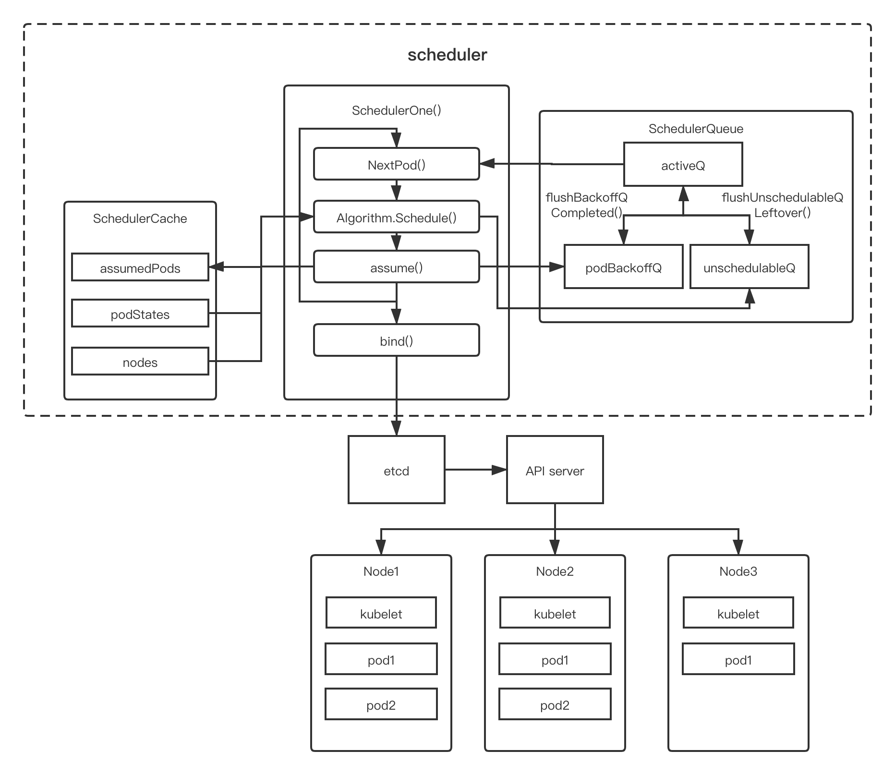
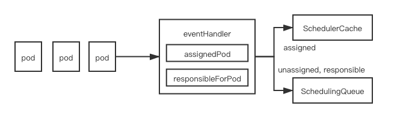
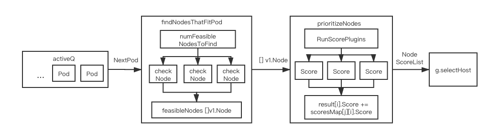
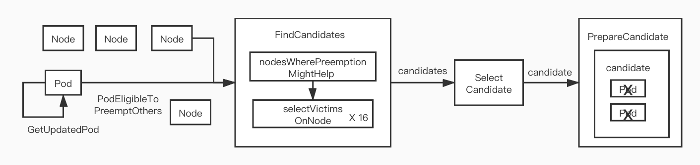
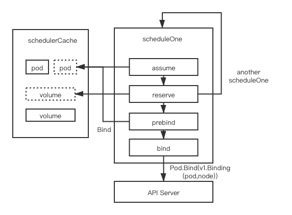

[kube-scheduler](#kube-scheduler)

- [工作原理](#工作原理)

  - [调度器架构 ](#调度器架构 )
  - [工作流程](#工作流程)
- [Setup源码分析](#Setup源码分析)
- [Run源码分析](#Run源码分析)

  -  [scheduleOne:Part1](#scheduleOnePart1) 
    	- [太长不看版](#太长不看版)
    	- [具体代码细节](#具体代码细节)
  - [scheduleOne:Part2](#scheduleOnePart2)
    - [太长不看版](#太长不看版)
    - [具体代码细节](#具体代码细节)
  - [scheduleOne:Part3](#scheduleOnePart3)
    - [具体代码细节](#具体代码细节)
- [总结](#总结)
- [参考](#参考)

[kube-scheduler](https://github.com/kuikuikuizzZ/note/blob/master/scheduler_public.md#kube-scheduler)

- [工作原理](https://github.com/kuikuikuizzZ/note/blob/master/scheduler_public.md#工作原理)
  - [调度器架构](https://github.com/kuikuikuizzZ/note/blob/master/scheduler_public.md#调度器架构)
  - [工作流程](https://github.com/kuikuikuizzZ/note/blob/master/scheduler_public.md#工作流程)
- [Setup源码分析](https://github.com/kuikuikuizzZ/note/blob/master/scheduler_public.md#Setup源码分析)
- [Run源码分析](https://github.com/kuikuikuizzZ/note/blob/master/scheduler_public.md#Run源码分析)
  - scheduleOne:Part1
    - [太长不看版](https://github.com/kuikuikuizzZ/note/blob/master/scheduler_public.md#太长不看版)
    - [具体代码细节](https://github.com/kuikuikuizzZ/note/blob/master/scheduler_public.md#具体代码细节)
  - scheduleOne:Part2
    - [太长不看版](https://github.com/kuikuikuizzZ/note/blob/master/scheduler_public.md#太长不看版)
    - [具体代码细节](https://github.com/kuikuikuizzZ/note/blob/master/scheduler_public.md#具体代码细节)
  - scheduleOne:Part3
    - [具体代码细节](https://github.com/kuikuikuizzZ/note/blob/master/scheduler_public.md#具体代码细节)
- [总结](https://github.com/kuikuikuizzZ/note/blob/master/scheduler_public.md#总结)
- 参考

# kube-scheduler

​		最近在看 k8s 调度相关的一些内容，希望给自己这阵子了解的知识进行一个整理，会连载几篇文章，都会关于调度的，初步的想法是 kubernetes 的默认调度器，然后是新引入的 scheduler framework，然后是 kube-batch 和 volcano， 如果还有时间会对这些内容做一个整体性的总结，和我自己的一些看法。这里是第一篇 kubenetes 的默认调度器。

​		**Kube-scheduler** 是 Kubernetes 的核心组件之一，主要根据一些调度算法，将没有调度将 [Pod](https://kubernetes.io/docs/concepts/workloads/pods/pod-overview/) 放置到合适的 [Node](https://kubernetes.io/zh/docs/concepts/architecture/nodes/) 上，然后对应 Node 上的 [Kubelet](https://kubernetes.io/docs/reference/generated/kubelet) 才能够运行这些 pod。可以认为 scheduler 就是集群负载的管理者，针对用户或者组件创建的 pod 的负载，为其在集群中找到一个合适的节点，然后让对应节点的 kubelet 服务进程将其运行起来。这篇文章的结构大概是这样的，我们先会从宏观上去看一下 scheduler 的工作原理，然后到每一个部分看一下对应关键代码的实现，其中会尝试去穿插一些我了解到的 scheduler 的版本迭代的过程，然后是一些思考和展望。为了方便复现和讲解，下面对kube-scheduler 代码的分析使用的是 kubernetes 的 v1.19.1 的版本的代码，如果是谈到其他版本也会在其中标注起来。

## 工作原理

Kubernetes 默认的调度器就在[kubernetes](https://github.com/kubernetes/kubernetes) 的 repos 中，跟其他的组件一样，都是把入口放在 cmd/kube-schduler 中，把实现放在 pkg/scheduler 中，也是用 cobra 命令行工具启动，我们先看一下，整体的架构。然后会从源码的角度一步步看其调用分析。

### 调度器架构 

调度器主要的组件如下：

pkg/scheduler/scheduler.go

```go
type Scheduler struct {
   // 主要是缓存现在集群调度的状态，如上图所示，会保留集群中所有已调度 pod 的状态，node 的状态，和assumedpod，防止 pod 被重新调度。
   SchedulerCache internalcache.Cache
	 // Algorithm 需要实现 Schedule 的方法，输入一个 pod 可以找到合适 node。默认是通过   
   // pkg/scheduler/core/generic_scheduler.go 的 generic_scheduler 实现的。
   Algorithm core.ScheduleAlgorithm
	 // 获取下一个 pod
   NextPod func() *framework.QueuedPodInfo

   // Error is called if there is an error. It is passed the pod in
   // question, and the error
   Error func(*framework.QueuedPodInfo, error)

   // Close this to shut down the scheduler.
   StopEverything <-chan struct{}

   // SchedulingQueue 会保留准备调度的 pod 的队列。
   SchedulingQueue internalqueue.SchedulingQueue

   // 所有的 plugin 都会以 profile 的形式供默认调度器使用
   Profiles profile.Map

   scheduledPodsHasSynced func() bool
	 // 用于和 api-server 的通信
   client clientset.Interface
}
```

​	    下图是我自己对 scheduler 架构的理解，调度主要的工作通过 informer  watch 有没有没有调度的 pod，如果有会尝试找一个合适的 node，然后把 pod 和 node 的 binding 写回给 apiserver。集群状态的信息保留在 schedulerCache 中，集群未调度的 pod 在 schedulingQueue 中。这里只拎出Algorithm，SchedulerCache，SchedulingQueue 来介绍，Profiles 主要是跟 plugins 相关的组件，后面会找在 scheduler framework 中介绍。



### 工作流程

-   首先 SchedulerCache 会通过 Informer 读取现在集群的 node, pod 的状态，缓存在内存中。同时监控集群资源状态（如果有创建 node 等事件发生也会及时同步） ，SchedulingQueue 会同时也会运行两个进程，分别定时把 BackoffQ 和 UnschedulabelQ 的 Pod 刷进去 activeQ 中。其中 activeQ 是通过heap 实现的待调度优先队列，BackoffQ ，UnschedulabelQ 顾名思义，是调度出错和不可调度队列，
-   如果有创建 pod 等事件的发生，且 pod 没有被调度过，会直接进入  SchedulingQueue 的 activeQ 队列中。如果已经调度了，就会进入 schedulerCache 中，把信息缓存起来。
-   scheduler 主进程会轮询地执行 scheduleOne 的流程
    -   通过 NextPod 接口从 activeQ 中读取入队 pod 的信息。
    -   然后通过 Algorithm (通过 pkg/scheduler/core/generic_scheduler 实现) 为这个 pod 尝试找到一个合适 node 进行调度，如果这一步失败了，如果设置了可以抢占会触发抢占，不过这里先不涉及，这样这个 pod 会进入 UnschedulabelQ 的队列中。
    -   如果调度成功会触发一次 assume，主要是在 cache 中记录这个 pod 为已经调度了，这样下次调度的时候就不会重新调度一次这个 pod。因为 assume 后面 scheduleOne 会起一个 goroutine 来负责 binding 的工作。scheduleOne 会跑下一个循环，如果没有 assume，可能导致 node 的资源会被重新使用等问题。
    -   binding 会通知 apiserver pod 和 node 的 binding 已经创建，让 api-server 通知 node 的 kubelet 去配置相应的环境，如（网络，存储等），如果 bind 成功。schedulerCache 会有一个进程 cleanupAssumedPods 不断地看这个pod 是否已经 binding 完成或者超时了，如果 binding 完成会去除这个 assume 的标志。
-   另外在 schedulingQueue 中，如上图的右侧部分，会起两个goroutine，flushUnschedulableQLeftover 会不断定时把之前调度失败的(UnschedulableQ) 送到 activeQ 中，flushUnschedulableQLeftover 会把出错的pod在 backoffQ 中往 activeQ刷。
-   schedulerCache 也会起一个 goroutine，会不断地把清理已经调度的，或者超时的 assume pod。


## Setup源码分析

​	   这里我会尝试以一种尽可能详尽（啰嗦）的方式去介绍 kube-scheduler 的源码实现，中间会穿插一下，我对 scheduler 版本迭代的一些理解。我们会从  cmd/kube-scheduler/app/server.go 开始说起。

在 cmd/kube-scheduler/app/server.go 中，会通过 cobra 命令行定义 scheduler 的启动命令，最终是运行 cmd/kube-scheduler/app/server.go 中 runCommand 定义的逻辑，调用 Setup 函数，如下：

```go
// runCommand runs the scheduler.
func runCommand(cmd *cobra.Command, opts *options.Options, registryOptions ...Option) error {
    ...
	ctx, cancel := context.WithCancel(context.Background())
	defer cancel()
    // Setup scheduler
	cc, sched, err := Setup(ctx, opts, registryOptions...)
	if err != nil {
		return err
	}

	if len(opts.WriteConfigTo) > 0 {...}
     // Run scheduler
	return Run(ctx, cc, sched)
}

// Setup 实现
func Setup(ctx context.Context, opts *options.Options, outOfTreeRegistryOptions ...Option) (*schedulerserverconfig.CompletedConfig, *scheduler.Scheduler, error) {
   if errs := opts.Validate(); len(errs) > 0 {
      return nil, nil, utilerrors.NewAggregate(errs)
   }
   // 1.初始化 client, EventBroadcaster,PodInformer,InformerFactory 并通过 config 回传。
   c, err := opts.Config()
   ...
   // Get the completed config
   cc := c.Complete()

   outOfTreeRegistry := make(runtime.Registry)
   for _, option := range outOfTreeRegistryOptions {
      if err := option(outOfTreeRegistry); err != nil {
         return nil, nil, err
      }
   }

   recorderFactory := getRecorderFactory(&cc)
   // 2.Create the scheduler.
   sched, err := scheduler.New(cc.Client,
      cc.InformerFactory,
      cc.PodInformer,
      recorderFactory,
      ctx.Done(),
      scheduler.WithProfiles(cc.ComponentConfig.Profiles...),
      scheduler.WithAlgorithmSource(cc.ComponentConfig.AlgorithmSource),
      scheduler.WithPercentageOfNodesToScore(cc.ComponentConfig.PercentageOfNodesToScore),
      scheduler.WithFrameworkOutOfTreeRegistry(outOfTreeRegistry),
      scheduler.WithPodMaxBackoffSeconds(cc.ComponentConfig.PodMaxBackoffSeconds),
      scheduler.WithPodInitialBackoffSeconds(cc.ComponentConfig.PodInitialBackoffSeconds),
      scheduler.WithExtenders(cc.ComponentConfig.Extenders...),
   )
   if err != nil {...}

   return &cc, sched, nil
}
```

Setup 函数主要干了几件事。 

### opt.config 

Setup 函数中，opt.Config() 主要做了下面几件事：

1.  createClients 启动 clientset
2.  events.NewEventBroadcasterAdapter(eventClient) 启动  EventBroadcaster
3.  c.InformerFactory = informers.NewSharedInformerFactory(client, 0) 启动 informer

上面这几步基本所有的 kubernetes 的组件基本都是有的，保证组件跟 api-server 的通信。

### scheduler.New 

然后 scheduler.New 启动 scheduler 实例：

pkg/scheduler/scheduler.go

```go
// New returns a Scheduler
func New(client clientset.Interface,
   	informerFactory informers.SharedInformerFactory,
   	podInformer coreinformers.PodInformer,
   	recorderFactory profile.RecorderFactory,
   	stopCh <-chan struct{},
   	opts ...Option) (*Scheduler, error) {
   	... // some config
   	// 初始化 schedulerCache
   	schedulerCache := internalcache.New(30*time.Second, stopEverything)
	// 注册 intree 的 plugins
   	registry := frameworkplugins.NewInTreeRegistry()
   	...
   	// 初始化 snapshot
   	snapshot := internalcache.NewEmptySnapshot()

   	configurator := &Configurator{
      client:                   client,
      recorderFactory:          recorderFactory,
      informerFactory:          informerFactory,
      podInformer:              podInformer,
      schedulerCache:           schedulerCache,
	  ...
      registry:                 registry,
      nodeInfoSnapshot:         snapshot,
      ...
   	}
   	...
   	var sched *Scheduler
   	// 通过上面 configurator 创建 scheduler(sched) 
   	// 可以通过 policy 或者 provider 创建
    switch {
	case source.Provider != nil:
		// Create the config from a named algorithm provider.
		sc, err := configurator.createFromProvider(*source.Provider)
        ...
	case source.Policy != nil:
		// Create the config from a user specified policy source.
		policy := &schedulerapi.Policy{}
		switch {
		case source.Policy.File != nil:
			initPolicyFromFile(source.Policy.File.Path, policy)
		}
        ...
    }
   	...
   	addAllEventHandlers(sched, informerFactory, podInformer)
   	return sched, nil
}

```

1. schedulerCache = internalcache.New(30*time.Second, stopEverything) 启动 scheduler 的缓存，主要是会启动 pkg/scheduler/internal/cache/cache.go:cleanupAssumedPods 这个函数定期清理AssumedPods。

2. registry := frameworkplugins.NewInTreeRegistry() 会读取所有 intree 的 plugins 注册掉，譬如：注册interpodaffinity 的调度算法，这种 plugin 的注册方式是通过 v1.15 开始引入的 scheduler  framework 实现的，我们这里不深入。

3. 初始化 Snapshot，初始化一个 map 保存 node 信息，是用在 Algorithm.Schedule 的过程中的，主要是保留一份 cache 的备份

4. Configurator 是scheduler 的配置器，创建 scheduler(sched) 可以通过  configurator.createFromConfig(\*policy\) 或者 configurator.createFromProvider(\*source.Provider) 来进行，不过无论使用哪种方式创建都会调用 configurator.create() 函数：

    - 初始化profiles(plugin)
    - 初始化 SchedulingQueue
    - 用 NewGenericScheduler 实例化 Algorithm

    至此，scheduler 的初始化工作基本完成了。

    pkg/scheduler/core/generic_scheduler.go

    ```go
    // create a scheduler from a set of registered plugins.
    func (c *Configurator) create() (*Scheduler, error) {
       var extenders []framework.Extender
       var ignoredExtendedResources []string
       if len(c.extenders) != 0 {
         ... // 如果有 extenders
       }
       if len(ignoredExtendedResources) > 0 {
         ... // 对 ignoredExtendedResources 有一些处理 
       }
    	 ...
       // 初始化 profiles
       profiles, err := profile.NewMap(c.profiles, c.buildFramework, c.recorderFactory,
          frameworkruntime.WithPodNominator(nominator))
       // 初始化队列优先级函数
       lessFn := profiles[c.profiles[0].SchedulerName].Framework.QueueSortFunc()
       // 初始化调度队列，需要优先级函数，和定义 backoffQ,UnScheduableQ 刷回 activeQ 的周期参数 
       podQueue := internalqueue.NewSchedulingQueue(
          lessFn,
          internalqueue.WithPodInitialBackoffDuration(time.Duration(c.podInitialBackoffSeconds)*time.Second),
          internalqueue.WithPodMaxBackoffDuration(time.Duration(c.podMaxBackoffSeconds)*time.Second),
          internalqueue.WithPodNominator(nominator),
       )
       // 使用 NewGenericScheduler 初始化 Algorithm
       algo := core.NewGenericScheduler(
          c.schedulerCache,
          c.nodeInfoSnapshot,
          extenders,
          c.informerFactory.Core().V1().PersistentVolumeClaims().Lister(),
          c.disablePreemption,
          c.percentageOfNodesToScore,
       )
    
       return &Scheduler{
          SchedulerCache:  c.schedulerCache,
          Algorithm:       algo,
          Profiles:        profiles,
          NextPod:         internalqueue.MakeNextPodFunc(podQueue),
          Error:           MakeDefaultErrorFunc(c.client, c.informerFactory.Core().V1().Pods().Lister(), podQueue, c.schedulerCache),
          StopEverything:  c.StopEverything,
          SchedulingQueue: podQueue,
       }, nil
    }
    ```

5. addAllEventHandlers 为 scheduler 提供 eventHandler，如上面架构图所示：event 的接收者主要有两个，SchedulerCache 和 SchedulingQueue，前者是为了跟踪集群的资源和已调度 Pod 的状态（addNodeToCache，addPodToCache），后者主要是给没有调度的 Pod 入队到 activeQ 中（addPodToSchedulingQueue）。这里重点说一下，scheduler 算是在这里完成第一次的过滤。如果是未调度的pod，会经过 event 的过滤器，其中 assignedPod(t) 会看 pod.Spec.NodeName 判断 pod 是不是已经调度或者 assume 了，responsibleForPod(t, sched.Profiles) 会看 pod.Spec.SchedulerName 看一下调度器名字是不是本调度器。

    

    pkg/scheduler/eventhandlers.go 

    ```go
    // addAllEventHandlers is a helper function used in tests and in Scheduler
    // to add event handlers for various informers.
    func addAllEventHandlers(
       sched *Scheduler,
       informerFactory informers.SharedInformerFactory,
       podInformer coreinformers.PodInformer,
    ) {
       // scheduled pod cache
       podInformer.Informer().AddEventHandler(
          cache.FilteringResourceEventHandler{
             FilterFunc: func(obj interface{}) bool {
                switch t := obj.(type) {
                case *v1.Pod:
                   return assignedPod(t)
                case cache.DeletedFinalStateUnknown:
                   ...
                default:
                   ...
                }
             },
             Handler: cache.ResourceEventHandlerFuncs{
                AddFunc:    sched.addPodToCache,
                UpdateFunc: sched.updatePodInCache,
                DeleteFunc: sched.deletePodFromCache,
             },
          },
       )
       // unscheduled pod queue
       podInformer.Informer().AddEventHandler(
          cache.FilteringResourceEventHandler{
             FilterFunc: func(obj interface{}) bool {
                switch t := obj.(type) {
                case *v1.Pod:
                   return !assignedPod(t) && responsibleForPod(t, sched.Profiles)
                case cache.DeletedFinalStateUnknown:
                   ...
                default:
                   ...
                }
             },
             Handler: cache.ResourceEventHandlerFuncs{
                AddFunc:    sched.addPodToSchedulingQueue,
                UpdateFunc: sched.updatePodInSchedulingQueue,
                DeleteFunc: sched.deletePodFromSchedulingQueue,
             },
          },
       )
    
       informerFactory.Core().V1().Nodes().Informer().AddEventHandler(
          cache.ResourceEventHandlerFuncs{
             AddFunc:    sched.addNodeToCache,
             UpdateFunc: sched.updateNodeInCache,
             DeleteFunc: sched.deleteNodeFromCache,
          },
       )
       ... 
       informerFactory.Core().V1().PersistentVolumes().Informer().AddEventHandler(...)   informerFactory.Core().V1().PersistentVolumeClaims().Informer().AddEventHandler(...)
       informerFactory.Core().V1().Services().Informer().AddEventHandler(...)
      informerFactory.Storage().V1().StorageClasses().Informer().AddEventHandler(...)
    }
    
    // 看一下是不是已经被调度了
    func assignedPod(pod *v1.Pod) bool {
    	return len(pod.Spec.NodeName) != 0
    }
    // 看一下是不是我们负责的
    func responsibleForPod(pod *v1.Pod, profiles profile.Map) bool {
    	return profiles.HandlesSchedulerName(pod.Spec.SchedulerName)
    }
    ```

总结一下，Setup 就是初始化scheduler 的各个部件，包括 informer, schedulerCache, schedulingQueue，和实例化 scheduler。

## Run源码分析

runCommand 在执行完 Setup() 之后会调用Run()，Run 主要分几个部分，首先一般都需要先启动 informer 并等待同步完成，表示集群的状态是已知的，然后启动 scheduler.Run()，会把schedulerCache的清理缓存，schedulingQueue 的定时入队，和 scheduler 主流程 scheduleOne 分别用 goroutine 启动。

cmd/kube-scheduler/app/server.go

```go
// Run executes the scheduler based on the given configuration. It only returns on error or when context is done.
func Run(ctx context.Context, cc *schedulerserverconfig.CompletedConfig, sched *scheduler.Scheduler) error {
   ... // some config

   // Prepare the event broadcaster.
   cc.EventBroadcaster.StartRecordingToSink(ctx.Done())

   ... // setup 健康检查的服务器.

   // Start all informers.
   go cc.PodInformer.Informer().Run(ctx.Done())
   cc.InformerFactory.Start(ctx.Done())

   // Wait for all caches to sync before scheduling.
   cc.InformerFactory.WaitForCacheSync(ctx.Done())

   // 选主逻辑
   if cc.LeaderElection != nil {
     ...
   }
  
   sched.Run(ctx)
   return fmt.Errorf("finished without leader elect")
}
```


```go
func (sched *Scheduler) Run(ctx context.Context) {
   if !cache.WaitForCacheSync(ctx.Done(), sched.scheduledPodsHasSynced) {
      return
   }
   sched.SchedulingQueue.Run()
   wait.UntilWithContext(ctx, sched.scheduleOne, 0)
   sched.SchedulingQueue.Close()
}
```

SchedulingQueue.Run() 会起两个 goroutine ，flushBackoffQCompleted 主要负责把所有 backoff 计时完毕（duration 会因为失败变长）的 pod 往 activeQ刷。flushUnschedulableQLeftover 把所有在 unschedulableQ 的 pod  计时unschedulableQTimeInterval 完毕后送去 activeQ。

### scheduleOnePart1

scheduleOne 是调度的主逻辑，下面会把 scheduleOne 的逻辑分为3部分，第一部分是调度部分，第二部分是对调度结果进行处理部分（抢占），第三部分是绑定等部分。



#### 太长不看版

- 如上图，从schedulingQueue 的待调度队列 activeQ 取出 pod。
- 进行预选执行 findNodesThatFitPod，会起多个 goroutine 去看 nodeInfo 合不合适，NodeAffinity 也是在这里检查，返回预选 nodes 列表。
-  进行优选 prioritizedNodes，也会起多个 goroutine 去尝试把待调度的 pod 放到 node 上，计算每个预选的 nodes 的得分，这里会看 node 上现有的 podInfo，podAffinity 也是在这里检查
- 每个nodes 的得分汇总起来给 selectHost 选出一个合适的 nodes。

#### 具体代码细节

pkg/scheduler/scheduler.go 


```go
// scheduleOne does the entire scheduling workflow for a single pod.  It is serialized on the scheduling algorithm's host fitting.
func (sched *Scheduler) scheduleOne(ctx context.Context) {
   podInfo := sched.NextPod()
   // pod could be nil when schedulerQueue is closed
   if podInfo == nil || podInfo.Pod == nil {
      return
   }
   pod := podInfo.Pod
   // 根据 prof 确定是不是要 skip 这个 pod
   prof, err := sched.profileForPod(pod)
   ...
   // 调度逻辑
   scheduleResult, err := sched.Algorithm.Schedule(schedulingCycleCtx, prof, state, pod)
   ... // 下面是 Part2

```

ScheudleOne 第一部分的逻辑如上：

  1.    首先 sched.NextPod() 会调用 scheduler 的 Pop 接口，后面会直接 PriorityQueue.activeQ.Pop()
  2.    查看 profile(plugin) 是否负责这个 pod，Profile, err := sched.profileForPod(pod) 【之前版本是 frameworkForPod】 会查看 pod 的 schedulername
  3.    skipPodSchedule 有两种情况 skip，(1) pod 正在被删除，(2) pod 被 assumed
  4.    scheduleResult, err := sched.Algorithm.Schedule这里会根据提供的算法调用 genericScheduler.Schedule 完成调度，这里需要展开一下。

```go
// pkg/scheduler/core/generic_scheduler.go
func (g *genericScheduler) Schedule(ctx context.Context, prof *profile.Profile, state *framework.CycleState, pod *v1.Pod) (result ScheduleResult, err error) {
   ... // some preprocess
   // 1. 生成这个时刻的 snapshot
   if err := g.snapshot(); err != nil {
      return result, err
   }
   ...
   // 2. 对 node 进行预选，过滤出合适的pod
   feasibleNodes, filteredNodesStatuses, err := g.findNodesThatFitPod(ctx, prof, state, pod)
   if err != nil {...}
   if len(feasibleNodes) == 0 {
       return result, &FitError{...)
   }
   ... // some metrics
   // 如果只有一个 node 合适就不会进入优选环节，直接返回
   if len(feasibleNodes) == 1 {
	 		... // some metrics
      return ScheduleResult{
         SuggestedHost:  feasibleNodes[0].Name,
         EvaluatedNodes: 1 + len(filteredNodesStatuses),
         FeasibleNodes:  1,
      }, nil
   }
   // 3. 对 node 进行优选
   priorityList, err := g.prioritizeNodes(ctx, prof, state, pod, feasibleNodes)
   if err != nil {
      return result, err
   }
	 ... // some metrics
   host, err := g.selectHost(priorityList)
   trace.Step("Prioritizing done")

   return ScheduleResult{
      SuggestedHost:  host,
      EvaluatedNodes: len(feasibleNodes) + len(filteredNodesStatuses),
      FeasibleNodes:  len(feasibleNodes),
   }, err
}
```


##### FindNodesThatFitPod

1.  生成一个这个时刻的 snapshot，主要是这个时刻的 nodeInfo map 生成一份快照

2.  findNodesThatFitPod 找什么 node 适合这个 pod，针对 node 的信息进行判断，其代码如下。

   ```go
//pkg/scheduler/core/generic_scheduler.go
   func (g *genericScheduler) findNodesThatFitPod(ctx context.Context, prof *profile.Profile, state *framework.CycleState, pod *v1.Pod) ([]*v1.Node, framework.NodeToStatusMap, error) {
         filteredNodesStatuses := make(framework.NodeToStatusMap)
   // Run "prefilter" plugins.
          // 1. 运行预过滤 plugin 逻辑
          s := prof.RunPreFilterPlugins(ctx, state, pod)
          ... //错误处理 
          // 2. 对 nodes 进行过滤，返回 nodes 列表
          feasibleNodes, err := g.findNodesThatPassFilters(ctx, prof, state, pod, filteredNodesStatuses)
          if err != nil {
             return nil, nil, err
          }
          // 3. 运行 extender 过滤逻辑
          feasibleNodes, err = g.findNodesThatPassExtenders(pod, feasibleNodes, filteredNodesStatuses)
          if err != nil {
             return nil, nil, err
          }
          return feasibleNodes, filteredNodesStatuses, nil
   }
   ```
   

   
1.  prof.RunPreFilterPlugins(ctx, state, pod) 先进行预过滤，主要对 pod 进行。
   
   2.  g.findNodesThatPassFilters(ctx, prof, state, pod, filteredNodesStatuses) 这部分会问这个 pod 调度到该 node 合适吗，主要会跟 node 中的 pod 进行亲和性检查等过滤性操作，这里展开一下：
       
       ```go
       func (g *genericScheduler) findNodesThatPassFilters(ctx context.Context, prof *profile.Profile, state *framework.CycleState, pod *v1.Pod, statuses framework.NodeToStatusMap) ([]*v1.Node, error) {
       	allNodes, err := g.nodeInfoSnapshot.NodeInfos().List()
           	if err != nil {
           		return nil, err
               }
              // 1. 选择总共多少个 nodes 尝试去调度
       numNodesToFind := g.numFeasibleNodesToFind(int32(len(allNodes)))
          
          	// Create feasible list with enough space to avoid growing it
          	// and allow assigning.
          	feasibleNodes := make([]*v1.Node, numNodesToFind)
       
          	if !prof.HasFilterPlugins() {
       	... //如果没有 filterPlugins, 直接返回所有的 nodes
          	}
       
          	errCh := parallelize.NewErrorChannel()
          	var statusesLock sync.Mutex
          	var feasibleNodesLen int32
          	ctx, cancel := context.WithCancel(ctx)
           // 2. 启动16个 goroutine 并行过滤，
          	checkNode := func(i int) {
          		nodeInfo := allNodes[(g.nextStartNodeIndex+i)%len(allNodes)]
          		fits, status, err := PodPassesFiltersOnNode(ctx, prof.PreemptHandle(), state, pod, nodeInfo)
          		if err != nil {...}
          		if fits {
          			length := atomic.AddInt32(&feasibleNodesLen, 1)
          			if length > numNodesToFind {
          				cancel()
          				atomic.AddInt32(&feasibleNodesLen, -1)
          			} else {
          				feasibleNodes[length-1] = nodeInfo.Node()
          			}
          		} else {
          			statusesLock.Lock()
          			if !status.IsSuccess() {
          				statuses[nodeInfo.Node().Name] = status
          			}
          			statusesLock.Unlock()
          		}
          	}
          
          	beginCheckNode := time.Now()
          	statusCode := framework.Success
          	defer func() {
          	... // some matrics
              // 起 16 个goroutine 跑 checkNode
          	parallelize.Until(ctx, len(allNodes), checkNode)
          	processedNodes := int(feasibleNodesLen) + len(statuses)
          	g.nextStartNodeIndex = (g.nextStartNodeIndex + processedNodes) % len(allNodes)
          
          	feasibleNodes = feasibleNodes[:feasibleNodesLen]
          	if err := errCh.ReceiveError(); err != nil {
          		statusCode = framework.Error
          		return nil, err
          	}
          	return feasibleNodes, nil
       }
       ```
       
       - 这里会定义 numNodesToFind := g.numFeasibleNodesToFind(int32(len(allNodes))) 确定遍历 node 的数目，如果集群太大，遍历所有的 node 是比较耗时的，默认是如果 nodes 数目小于100，会遍历所有 node，如果太多会取百分比。 
       - 然后  会通过 parallelize 提供的并发接口调用 checkNode，一般并发数量为 16。checkNode 会调用 PodPassesFiltersOnNode ，会通过 RunFilterPlugins 运行各个 filterplugins 主要是看一下pod 跟在 node 里面的pod 有没有不兼容的关系，查一下优先级是不是equal 或者有比上面的pod 大，如果可以抢占？
       - checkNode 会返回不同node 的适不适合的信息，如果适合，信息放在一个list 中 feasibleNodes[length-1] = nodeInfo.Node()；如果不适合，在 statuses[nodeInfo.Node().Name] = status 登记错误信息
       - findNodesThatPassExtenders 会遍历不同 extender，针对不同的资源，Filter(pod, feasibleNodes) 主要也是用户写的custom filter，也是返回 feasibleNodes（ []v1.Node）。
       
3.  前面 findNodesThatFitPod 返回了合适 []v1.Node，g.prioritizeNodes 会根据一些优先级算法计算不同node的得分给出这些node 的排序。
   
       ```go
       func (g *genericScheduler) prioritizeNodes(
       	ctx context.Context,
       	prof *profile.Profile,
       	state *framework.CycleState,
       	pod *v1.Pod,
       	nodes []*v1.Node,
       ) (framework.NodeScoreList, error) {
           ...
       	// Run PreScore plugins.
       	preScoreStatus := prof.RunPreScorePlugins(ctx, state, pod, nodes)
       	if !preScoreStatus.IsSuccess() {
       		return nil, preScoreStatus.AsError()
       	}
       
       	// Run the Score plugins.
       	scoresMap, scoreStatus := prof.RunScorePlugins(ctx, state, pod, nodes)
       	if !scoreStatus.IsSuccess() {
       		return nil, scoreStatus.AsError()
       	}
       	...
       	// Summarize all scores. 汇总所有 node 的分数
       	result := make(framework.NodeScoreList, 0, len(nodes))
       
       	for i := range nodes {
       		result = append(result, framework.NodeScore{Name: nodes[i].Name, Score: 0})
       		for j := range scoresMap {
       			result[i].Score += scoresMap[j][i].Score
       		}
       	}
       	// 不同的extender 使用不同的goroutine 调用Prioritize函数
       	if len(g.extenders) != 0 && nodes != nil {
       		...
       	}
       	...
       	return result, nil
       }
       ```
       
       -  分别调用不同 plugin 的 RunPreScorePlugins 前置评分
       - RunScorePlugins 获取每个 plugin 对每个预选节点的分数，这里主要看一下，pod 调度上去会不会跟上面的 pod 有亲和性的关系(affinity) 等。如果说前面 filter 主要是针对 node 进行评价，这里主要是针对 node 里面的 pod 进行评价。
       - 上面默认会起 16 goroutine 来对每个 plugin 进行计分，返回的 scoreMap key 是 plugin, 元素是一个 nodescore list，表示对每个节点的评分。
       - 然后把所有的分数汇总在 result 中
       - 如果有 extender 会分别起不同的 goroutine 去调用 extender.Prioritize，结果也是汇总到 result 中。
       
   4.  然后 host, err := g.selectHost(priorityList) 会根据前面 findNodesThatFitPod 的排序结果选择一个合适的pod。

### scheduleOnePart2

继续 scheduleOne 的逻辑，这部分是指调度失败的错误处理。主要是抢占和驱逐，这部分跟上一部分的逻辑比较类似，不过输入的 nodes，会有一些过滤。



#### 太长不看版

- 首先会通过 GetUpdatedPod 更新一下 pod 的信息
- 然后 PodEligibleToPreemptOthers 看一下 pod 是否可以抢占，主要判断是不是已经抢占了
- FindCandidates 会调用 nodesWherePreemptionMightHelp 对 node 进行预选过滤，保留硬性的过滤条件跟前面调度时 predicate 逻辑类似，selectVictims 是对 node 打分，跟前面 prioritize 类似。
- 然后 SelectCandidate 选择合适抢占的 node，这个跟前面 selectHost 类似。
- PrepareCandidate  清出足够的空间给 pod 调度上去。 不过这里在多调度器的时候可能会有一些问题，有可能刚清出资源就被其他调度器抢走了，造成不断循环。

#### 具体代码细节

pkg/scheduler/scheduler.go: scheduleOne

```go
    // 接着 part1 部分 
	scheduleResult, err := sched.Algorithm.Schedule(schedulingCycleCtx, prof, state, pod)
   if err != nil {
      nominatedNode := ""
      if fitError, ok := err.(*core.FitError); ok {
         if !prof.HasPostFilterPlugins() {
            klog.V(3).Infof("No PostFilter plugins are registered, so no preemption will be performed.")
         } else {
           // 后处理逻辑，（preempt）在这里实现。
            result, status := prof.RunPostFilterPlugins(ctx, state, pod, fitError.FilteredNodesStatuses)
            ... // 后处理
         }
      }
      // 记录 SchedulingFailure，pod 入队 UnschedulableQ
      sched.recordSchedulingFailure(prof, podInfo, err, v1.PodReasonUnschedulable, nominatedNode)
      return
   }
```

-   如果前面调度失败，会进入的处理错误逻辑，尝试调用 prof.RunPostFilterPlugins。这个是引入 scheduler framework 之后的形式，在 v1.15 之前的版本，是只有抢占的逻辑，如下 （github.com/kubernetes/kubernetes:**v1.14.1** ）

    pkg/scheduler/scheduler.go: scheduleOne

    ```go
    	scheduleResult, err := sched.Algorithm.Schedule(schedulingCycleCtx, prof, state, pod)
    	if err != nil {
            // 如果调度失败
    		if fitError, ok := err.(*core.FitError); ok {
    			if !util.PodPriorityEnabled() || sched.config.DisablePreemption {
                  ... // 如果不允许抢占
    			} else {
    				preemptionStartTime := time.Now()
    				sched.preempt(pod, fitError)
    				... // some metrics
    			}
    			metrics.PodScheduleFailures.Inc()
    		} else {
    		    ... // 其他错误
    		}
    		return
    	}
    ```

    我们还是以 v1.19.1 plugin 中的抢占逻辑进行分析。

    pkg/scheduler/framework/plugins/defaultpreemption/default_preemption.go

    ```go
    func (pl *DefaultPreemption) preempt(ctx context.Context, state *framework.CycleState, pod *v1.Pod, m framework.NodeToStatusMap) (string, error) {
    	cs := pl.fh.ClientSet()
    	ph := pl.fh.PreemptHandle()
    	nodeLister := pl.fh.SnapshotSharedLister().NodeInfos()
    
    	// 0) Fetch the latest version of <pod>.
    	pod, err := util.GetUpdatedPod(cs, pod)
    	if err != nil {
    		klog.Errorf("Error getting the updated preemptor pod object: %v", err)
    		return "", err
    	}
    
    	// 1) Ensure the preemptor is eligible to preempt other pods.
    	if !PodEligibleToPreemptOthers(pod, nodeLister, m[pod.Status.NominatedNodeName]) {...}
    
    	// 2) Find all preemption candidates.
    	candidates, err := FindCandidates(ctx, cs, state, pod, m, ph, nodeLister, pl.pdbLister)
    	if err != nil || len(candidates) == 0 {...}
    
    	// 3) Interact with registered Extenders to filter out some candidates if needed.
    	candidates, err = CallExtenders(ph.Extenders(), pod, nodeLister, candidates)
    	if err != nil {
    		return "", err
    	}
    
    	// 4) Find the best candidate.
    	bestCandidate := SelectCandidate(candidates)
    	if bestCandidate == nil || len(bestCandidate.Name()) == 0 {
    		return "", nil
    	}
    
    	// 5) Perform preparation work before nominating the selected candidate.
    	if err := PrepareCandidate(bestCandidate, pl.fh, cs, pod); err != nil {
    		return "", err
    	}
    
    	return bestCandidate.Name(), nil
    }
    ```

    抢占（preempt）的代码也比较清晰，可以参考注释来理解工作原理：

    -   首先是通过GetUpdatedPod，确认最新的 pod 的版本（保证新的改动可以被接收到）

    -   然后 PodEligibleToPreemptOthers 看一下这个 pod 适不适合执行抢占，因为这个pod 有可能已经抢占过了， 然后被抢占的pod 也在 terminating 了，就不会发生抢占。

    -   FindCandidates 用于找到合适被抢占的候选nodes

        ```go
        // Each candidate is executable to make the given <pod> schedulable.
        func FindCandidates(ctx context.Context, cs kubernetes.Interface, state *framework.CycleState, pod *v1.Pod,
        	m framework.NodeToStatusMap, ph framework.PreemptHandle, nodeLister framework.NodeInfoLister,
        	pdbLister policylisters.PodDisruptionBudgetLister) ([]Candidate, error) {
        	allNodes, err := nodeLister.List()
        	if err != nil {
        		return nil, err
        	}
        	if len(allNodes) == 0 {
        		return nil, core.ErrNoNodesAvailable
        	}
        
        	potentialNodes := nodesWherePreemptionMightHelp(allNodes, m)
        	... 
        	return dryRunPreemption(ctx, ph, state, pod, potentialNodes, pdbs), nil
        }
        ```

        -   首先 nodesWherePreemptionMightHelp 会把所有的nodes 重新查看一下，如果是因为 predicates 检查不通过的，尝试在上面去除 pod 看是否可能通过

        -   然后把 pod 和 potential node 输入到 dryRunPreemption  中，dryRunPreemption 会起多个进程进行跟前面 schedule 里面 checkNode 类似，通过 checkNode 运行 **selectVictimsOnNode**，这个函数会尝试找到最小被抢占 pods 的集合（只要低优先级的 pods 够，就不会抢占node 内高优先级的)。

        -   返回汇总后的cadidates 信息， 包括node 中被抢占 pods 的信息，

            ```go
            func selectVictimsOnNode(
            	ctx context.Context,
            	ph framework.PreemptHandle,
            	state *framework.CycleState,
            	pod *v1.Pod,
            	nodeInfo *framework.NodeInfo,
            	pdbs []*policy.PodDisruptionBudget,
            ) ([]*v1.Pod, int, bool){
                ...
                // 筛选被抢占的 pod
            	podPriority := podutil.GetPodPriority(pod)
                for _, p := range nodeInfo.Pods {
                   if podutil.GetPodPriority(p.Pod) < podPriority {
                      potentialVictims = append(potentialVictims, p.Pod)
                      if err := removePod(p.Pod); err != nil {
                         return nil, 0, false
                      }
                   }
                }
                // 保留一些不必被抢占的，把 pod 分两类，一个是 如果抢占会造成违反了 PodDisruptionBudget(PDB) 的 pod（violatingVictims），一个是不会violatingVictims
               	violatingVictims, nonViolatingVictims := filterPodsWithPDBViolation(potentialVictims, pdbs)
            	for _, p := range violatingVictims {
            		if fits, err := reprievePod(p); err != nil {
            			klog.Warningf("Failed to reprieve pod %q: %v", p.Name, err)
            			return nil, 0, false
            		} else if !fits {
            			numViolatingVictim++
            		}
            	}
            }
            ```

    -   然后 SelectCandidate 选择最好的candidate，有一系列判断准则：

        -   这个 node 是不是满足 Pod 干扰预算的条件。

        -   这个 node 是不是只需要驱逐的pod 的优先级是不是最小的

        -    驱逐这些pod 这个 node affinity 有没有被影响

        -   是不是驱逐的 pod 数目最小

            ...

    -   PrepareCandidate 会驱逐 victims pod，如果这些 pod 在waitting，不给调度，清楚他们的nominatedNodeName，如果有比较低优先级的pods 被提名到这个 node 会不合适。

### scheduleOnePart3



#### 具体代码细节

pkg/scheduler/scheduler.go: scheduleOne

```go
   scheduleResult, err := sched.Algorithm.Schedule(schedulingCycleCtx, prof, state, pod)
   if err != nil{...}
   ...
   // 1. assume 设置 schedulerCache 
   err = sched.assume(assumedPod, scheduleResult.SuggestedHost)
   ...
   // 2. reserve 预留 volume 等改动
   if sts := prof.RunReservePluginsReserve(schedulingCycleCtx, state, assumedPod, scheduleResult.SuggestedHost); !sts.IsSuccess() {...}
   // 3. 是否满足 permit 条件 
   runPermitStatus := prof.RunPermitPlugins(schedulingCycleCtx, state, assumedPod, scheduleResult.SuggestedHost)
   // bind the pod to its host asynchronously (we can do this b/c of the assumption step above).
   go func() {
      bindingCycleCtx, cancel := context.WithCancel(ctx)
      // 等待 permit 条件完备
      waitOnPermitStatus := prof.WaitOnPermit(bindingCycleCtx, assumedPod)
      if !waitOnPermitStatus.IsSuccess() {...}
      // Run "prebind" plugins.
      preBindStatus := prof.RunPreBindPlugins(bindingCycleCtx, state, assumedPod, scheduleResult.SuggestedHost)
      if !preBindStatus.IsSuccess() {...}
      // 5. 绑定 pod 和 node
      err := sched.bind(bindingCycleCtx, prof, assumedPod, scheduleResult.SuggestedHost, state)
      if err != nil {...}
		... // some metrics
         // Run "postbind" plugins.
         prof.RunPostBindPlugins(bindingCycleCtx, state, assumedPod, scheduleResult.SuggestedHost)
      }
   }()
}
```

-   如果前面 part1 schedule 的 sched.Algorithm.Schedule 调度算法调度成功，scheduleResult 返回一个建议调度的node，然后调用 sched.assume，这里主要是在 cache 中记录这个 pod 为已经调度了，这样下次调度的时候就不会重新调度一次这个 pod。
-   然后会调用，RunReservePluginsReserve，RunPermitPlugins，这些 plugins 设置的位点，我们假设没有plugins 设置了先跳过。
    
    -   reserve 会执行像 AssumePodVolumes 等，除了 pod assume 之外需要在 cache 保留的操作，unreserve 类似。
-   RunPermitPlugins 会成为bind 的准入，就是前面reserve 之后相关的资源就不会被使用了，不过还有一些条件没有满足，所以不可以 bind，就是为了占着资源，类似 gang-scheduling 的时候会用到。

-   就会进入绑定的逻辑（bind），bind 会另外起一个 goroutine 所以到这里，scheduleOne 就会到下一个调度循环了，使用这样的做法是 bind 实际上比较耗时，所以使用另外的进程进行，不会阻塞到调度，不过有趣的是在早期的 scheduler，并不是一开始就是这样的结构的，如v1.0.0 的版本中，调度完之后会直接 binding，会有比较大性能的损耗。

    plugin/pkg/scheduler/scheduler.go 这时 scheduler 还在 plugins 中

    ```go
    func (s *Scheduler) scheduleOne() {
        dest, err := s.config.Algorithm.Schedule(pod, s.config.MinionLister)
        ...
        b := &api.Binding{
           ObjectMeta: api.ObjectMeta{Namespace: pod.Namespace, Name: pod.Name},
           Target: api.ObjectReference{
              Kind: "Node",
              Name: dest,
           },
        }
        s.config.Modeler.LockedAction(func() {
           bindingStart := time.Now()
           err := s.config.Binder.Bind(b)
           metrics.BindingLatency.Observe(metrics.SinceInMicroseconds(bindingStart))
           if err != nil {...}
           assumed := *pod
           assumed.Spec.NodeName = dest
           s.config.Modeler.AssumePod(&assumed)
        })
    }
    ```

-   sched.bind 首先 WaitOnPermit 会查看一下 permit 是否完成，前面 permit 实际上是在这里被挡住

-   然后会运行一些 prebind 的操作，像网络配置，存储配置等，像volumeBinder 会

    -   init volume bind, pv -> pvc 
    -   触发 volume provisioning 
    -   等待 pvc binding 完成

-   Prebind 成功就会 Bind， pod -> node，defaultBinder 就很简单

    pkg/scheduler/framework/plugins/defaultbinder/default_binder.go

    ```go
    // Bind binds pods to nodes using the k8s client.
    func (b DefaultBinder) Bind(ctx context.Context, state *framework.CycleState, p *v1.Pod, nodeName string) *framework.Status {
       binding := &v1.Binding{
          ObjectMeta: metav1.ObjectMeta{Namespace: p.Namespace, Name: p.Name, UID: p.UID},
          Target:     v1.ObjectReference{Kind: "Node", Name: nodeName},
       }
       // 创建 bind
       err := b.handle.ClientSet().CoreV1().Pods(binding.Namespace).Bind(ctx, binding, metav1.CreateOptions{})
       if err != nil {
          return framework.NewStatus(framework.Error, err.Error())
       }
       return nil
    }
    ```

    如果成功会 RunPostBindPlugin，暂时没有 default 的 postBindPlugin.

## 总结

​	   总体上说，kube-scheduler 的工作方式和其他的 controller 并没有什么不同。如果把 scheduler 看成是一个黑盒的话， 可以认为 scheduler 的输入是一个个的 Pod，输出就是这个Pod 和某个节点 node 的绑定(Bind)，如果是 controller 可能是输入一个资源，出去的是更新之后资源。它不对绑定成功与否负责，只是作为资源的分配者。某程度上，没有 scheduler 的话 kubernetes 也能正常运行，只需要手动创建 pod，然后使用 client 执行 `CoreV1().Pods(binding.Namespace).Bind(ctx, binding, metav1.CreateOptions{})` 基本等同于实现了scheduler 的功能。

​      kube-scheduler 的设计比较简单，在多个版本的迭代中，其基本的逻辑没有特别大的变化，都是笨笨地一个个 pod 入队处理，我们在文中也穿插了一些相关的内容。我自己暂时感觉这部分还不是写得特别好，一个自己的功力还不够，一个是自己可以了解到的线索也太少，希望后续的更新可以完善。提出这个部分，我自己的思考是了解一下 kube-scheduler 的发展，顺便窥见软件工程的迭代概貌。我自己的理解是大致上都会遵循这样的一个历程：可用性 -> 性能优化 -> 可扩展性，然后在迭代的过程中保持稳定性。

​	   另外，这里我刻意地把 plugins 和 extender 的部分进行了删减，一个是为了控制篇幅，一个是希望把这些可以 custom 的部分留待下一部分的 scheduler-framework 一并讲述。


## 参考

- [kubernetes](https://github.com/kubernetes/kubernetes)
- [kubernetes 调度与驱逐](https://kubernetes.io/docs/concepts/scheduling-eviction/)

- [kube-scheduler 源码解析](https://www.infoq.cn/article/CHGOHJ8ybvXuEmhy1SFy)
- [Kubernetes源码剖析](https://book.douban.com/subject/35100082/)
- [Kubenetes community](https://github.com/kubernetes/community)

