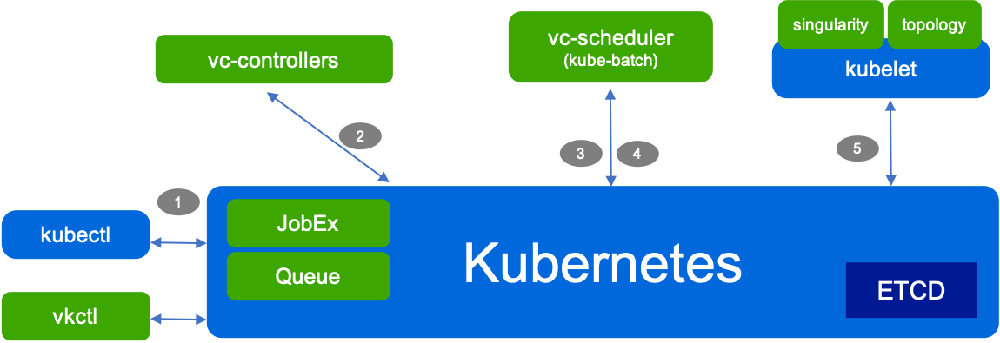
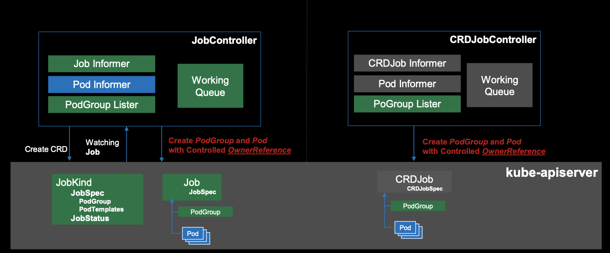
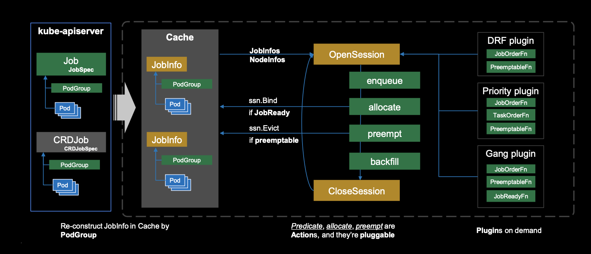

#  Volcano（scheduler 03）

- [介绍](#介绍)
- [流程分析](#流程分析)
  - [概述](#概述)
  - [创建job](#创建job)
    - [主流程](#主流程)
    - [volcanojobVSbatch/v1Job](#volcanojobVSbatch/v1Job)
    - [volcanojobVSCRDjob](#volcanojobVSCRDjob		)
  - [同步信息](#同步信息)
    - [主流程](#主流程)
    - [scheduler初始化](#scheduler初始化)
    - [cacheInfo ](#cacheInfo )
  - [调度](#调度)
    - [概述](#概述)
    - [OpenSession](#OpenSession)
    - [enqueue](#enqueue)
    - [allocate](#allocate)
    - [调度回顾](#调度回顾)
  - [Plugin机制](#Plugin机制)
- [参考](#参考)

## 介绍

​		除了前面聊到的通过 scheduler framework 对 kubernetes 的调度特性进行扩展之外，还可以通过多调度器的方式进行扩展，因为我自己的背景关系，会比较关注跟机器学习工作负载相关的的调度器，现在社区比较成熟的方案有 kube-batch，和由其延伸出来的 volcano，主要是补足了 kubernetes 批调度的短板，其社区也比较活跃。

​		因为 volcano 是植根于 kube-batch，不过添加了更加多的 feature（如提供了一个 controller Manager 用于管理 volcano 自己可扩展的 job CRD 和 queue，podgroup 等资源，还有一系列命令行工具），而 kube-batch 主要以批调度器为主，这篇文章会着重于从源码的角度分析 volcano，中间如果有需要会穿插跟 kube-batch 的异同。文章组织上，我自己想从创建一个 volcano 的 job 开始，逐步对其调度流程进行分析。为了讲述和复现的方便，我们这里源码是根据 volcano v1.1.0 的版本进行分析的。

## 流程分析

### 概述

使用 volcano 的调度流程如下，具体分 5 步，我们后面会着重去分析第2，3步的作业处理。



-   使用 kubectl 创建一个 volcano job。
-   vc-controller 监测到这个 job 的创建，会创建对应的 pod 和 podgroup。
-   通过 vc-scheduler 找到合适的 node 
-   向 api-server 申请 pod 和 node 的绑定
-   kubelet 看到有 pod 进行绑定，启动容器。 

### 创建job

#### 主流程

 我们以 examples 中的 tensorflow examples 进行分析：

example/integrations/tensorflow/dist-mnist/tf-dist-mnist-example.yaml

```yaml
apiVersion: batch.volcano.sh/v1alpha1
kind: Job
metadata:
  name: tensorflow-benchmark
  labels:
    "volcano.sh/job-type": "Tensorflow"
spec:
  minAvailable: 3
  schedulerName: volcano
  plugins:
    env: []
    svc: []
  policies:
    - event: PodEvicted
      action: RestartJob
  tasks:
    - replicas: 1
      name: ps
      template:
        spec:
          imagePullSecrets:
            - name: default-secret
          containers:
            - command:
                - sh
                - -c
                - |
                  PS_HOST=`cat /etc/volcano/ps.host | sed 's/$/&:2222/g' | tr "\n" ","`;
                  WORKER_HOST=`cat /etc/volcano/worker.host | sed 's/$/&:2222/g' | tr "\n" ","`;
                  python tf_cnn_benchmarks.py --batch_size=32 --model=resnet50 --variable_update=parameter_server --flush_stdout=true --num_gpus=1 --local_parameter_device=cpu --device=cpu --data_format=NHWC --job_name=ps --task_index=${VK_TASK_INDEX} --ps_hosts=${PS_HOST} --worker_hosts=${WORKER_HOST}
              image: volcanosh/example-tf:0.0.1
              name: tensorflow
              ports:
                - containerPort: 2222
                  name: tfjob-port
              resources:
                requests:
                  cpu: "1000m"
                  memory: "2048Mi"
                limits:
                  cpu: "1000m"
                  memory: "2048Mi"
              workingDir: /opt/tf-benchmarks/scripts/tf_cnn_benchmarks
          restartPolicy: OnFailure
    - replicas: 2
      name: worker
      policies:
        - event: TaskCompleted
          action: CompleteJob
      template:
        spec:
          imagePullSecrets:
            - name: default-secret
          containers:
            - command:
                - sh
                - -c
                - |
                  PS_HOST=`cat /etc/volcano/ps.host | sed 's/$/&:2222/g' | tr "\n" ","`;
                  WORKER_HOST=`cat /etc/volcano/worker.host | sed 's/$/&:2222/g' | tr "\n" ","`;
                  python tf_cnn_benchmarks.py --batch_size=32 --model=resnet50 --variable_update=parameter_server --flush_stdout=true --num_gpus=1 --local_parameter_device=cpu --device=cpu --data_format=NHWC --job_name=worker --task_index=${VK_TASK_INDEX} --ps_hosts=${PS_HOST} --worker_hosts=${WORKER_HOST}
              image: volcanosh/example-tf:0.0.1
              name: tensorflow
              ports:
                - containerPort: 2222
                  name: tfjob-port
              resources:
                requests:
                  cpu: "2000m"
                  memory: "2048Mi"
                limits:
                  cpu: "2000m"
                  memory: "4096Mi"
              workingDir: /opt/tf-benchmarks/scripts/tf_cnn_benchmarks
          restartPolicy: OnFailure
```

如果 volcano 已经部署，这个 job 会被 controller-manager 中的 job controller 监测到，如果 job 自身的状态没有问题，会进入 pkg/controllers/job/job_controller_actions.go 中 syncJob 的逻辑，然后 job  controller 会做以下几件事：

-   initiate Job：主要是把注册的 plugins 作用到这个 job 上。
-   创建这个 job 对应的 podgroup (默认使用 volcanoJob 都会创建），然后用 job.spec.minAvailable 填写 podgroup 的minAvailable 字段。
-   然后根据 job 中的 template 异步创建对应的 pod，也会把对应的 plugin 等信息添加上。
-   最后 updateJobStatus。

现在集群中有这个 job 对应的 pod，和 podgroup 了。

#### volcanojobVSbatch/v1Job

上面聊到的 volcano job（pkg/apis/batch/v1alpha1/job.go） 对比 kubernetes 下 batch/v1的 job， 主要有以下区别：

-   volcano job 会多了 SchedulerName，MinAvailable， Queue 等字段，主要是为了更契合 volcano 的调度方式。
-   使用  []TaskSpec，替代 PodTemplateSpec 作为 pod 实例的模板，因为一个 taskSpec 有一个 PodTemplateSpec，可以支持多种实例，这个跟 kubeflow 的 CRDjobs (tfjob,pytorchjob) 是比较类似的。
-   Plugins 字段主要是方便做一些 mutating，如注入 env，ssh 等。

下面是 volcano job 的定义：(pkg/apis/batch/v1alpha1/job.go)

```go
// Job defines the volcano job.
type Job struct {
   metav1.TypeMeta `json:",inline"`

   metav1.ObjectMeta `json:"metadata,omitempty" protobuf:"bytes,1,opt,name=metadata"`

   Spec JobSpec `json:"spec,omitempty" protobuf:"bytes,2,opt,name=spec"`

   Status JobStatus `json:"status,omitempty" protobuf:"bytes,3,opt,name=status"`
}

type JobSpec struct {
   SchedulerName string `json:"schedulerName,omitempty" protobuf:"bytes,1,opt,name=schedulerName"`

   MinAvailable int32 `json:"minAvailable,omitempty" protobuf:"bytes,2,opt,name=minAvailable"`

   Volumes []VolumeSpec `json:"volumes,omitempty" protobuf:"bytes,3,opt,name=volumes"`

   Tasks []TaskSpec `json:"tasks,omitempty" protobuf:"bytes,4,opt,name=tasks"`

   Policies []LifecyclePolicy `json:"policies,omitempty" protobuf:"bytes,5,opt,name=policies"`

   Plugins map[string][]string `json:"plugins,omitempty" protobuf:"bytes,6,opt,name=plugins"`

   RunningEstimate *metav1.Duration `json:"runningEstimate,omitempty" protobuf:"bytes,4,opt,name=runningEstimate"`

   Queue string `json:"queue,omitempty" protobuf:"bytes,7,opt,name=queue"`

   MaxRetry int32 `json:"maxRetry,omitempty" protobuf:"bytes,8,opt,name=maxRetry"`

   TTLSecondsAfterFinished *int32 `json:"ttlSecondsAfterFinished,omitempty" protobuf:"varint,9,opt,name=ttlSecondsAfterFinished"`

   PriorityClassName string `json:"priorityClassName,omitempty" protobuf:"bytes,10,opt,name=priorityClassName"`
}
type TaskSpec struct {

	Name string `json:"name,omitempty" protobuf:"bytes,1,opt,name=name"`

	Replicas int32 `json:"replicas,omitempty" protobuf:"bytes,2,opt,name=replicas"`

	Template v1.PodTemplateSpec `json:"template,omitempty" protobuf:"bytes,3,opt,name=template"`

	Policies []LifecyclePolicy `json:"policies,omitempty" protobuf:"bytes,4,opt,name=policies"`
}

```

#### volcanojobVSCRDjob		

另外，从上面流程分析可以看到，volcano job controller 同步之后主要是创建了 pod 和 podgroup，然后 volcano 的 scheduler 也不会单独去 watch volcanojob，所以后续调度流程主要就是通过 pod，podgroup 的信息来实现的，job controller 只会同步一下 status。这样也给开发者带来了灵活性，其他的 CRD jobs 也可以通过这样的机制，让自己的 CRD jobs 使用 volcano 调度起来，具体可能还需要 podgroup controller 的协助，实例如下图。具体可以参考一下，[tf-operator](https://github.com/kubeflow/tf-operator) 的实现这里就不展开了。      



**总结**：这一步 job controller 通过 job 的模板信息创建了对应的 pod 和 podgroup。

### 同步信息

#### 主流程

上面的步骤创建了 volcanojob 对应的 pod，和 podgroup，会直接被 scheduler 监测到，然后触发 podInformer，podgroupInformer 的 addPod 和 addPodGroupV1beta1  eventHandler。

其中 AddPod 会干以下几件事：

-   对 pod 生成一个对应的 taskInfo，并生成一个 jobID。
-   如果在 schedulerCache 的 jobs 没有这个 jobID，创建这个 jobInfo，然后把这个 task 放到 job.Tasks 中。
-   如果已经分配了 node，也会在 schedulerCache的 nodes 里面记录这个task。

如果是触发了AddPodGroupV1beta1 会做以下几件事：

-   也会找schedulerCache jobs 里面有没有这个 podgroup 对应的 job，没有就创建一下。
-   然后把 podgroup 的信息（MinAvailable，Queue）等传递给 JobInfo

可以认为看到pod，podgroup 的创建，eventHandler 会在 schedulerCache 的 jobs 增加一个对应 jobInfo。

#### scheduler初始化

上面提到了 taskInfo, JobInfo, nodeInfo 等概念，这里作一下说明，顺便也对 scheduler 的启动做一些分析。

scheduler 的入口是通过 cmd/scheduler/main.go，调用 cmd/scheduler/app/server.go 的 Run 函数启动的。下面截取了 Run 函数比较重要的部分，主要是调用 NewScheduler，启动一个scheduler，然后调用 scheduler.Run 函数运行。

```go
func Run(opt *options.ServerOption) error {
  
   config, err := kube.BuildConfig(opt.KubeClientOptions)
   if err != nil {
      return err
   }

   sched, err := scheduler.NewScheduler(config,
      opt.SchedulerName,
      opt.SchedulerConf,
      opt.SchedulePeriod,
      opt.DefaultQueue)
   if err != nil {
      panic(err)
   }

	 ... // StartHealthz 

   run := func(ctx context.Context) {
      sched.Run(ctx.Done())
      <-ctx.Done()
   }

   if !opt.EnableLeaderElection {
      run(context.TODO())
      return fmt.Errorf("finished without leader elect")
   }
   ... // EnableLeaderElection Do
}
```

NewScheduler 会通过 schedcache.New 调用 pkg/scheduler/cache/cache.go 下的newSchedulerCache。这个函数主要做了几件事：

-   初始化各个 client。
-   初始化各个 informer。
-   通过初始化的 informer 注册各个 eventHandler，上面 AddPod, 和 AddPodGroupV1beta1 也是在这里注册。
-   利用上面初始化的信息初始化SchedulerCache。

SchedulerCache 的定义如下：

pkg/scheduler/cache/cache.go

```go
// SchedulerCache cache for the kube batch
type SchedulerCache struct {
   sync.Mutex

   kubeClient *kubernetes.Clientset
   vcClient   *vcclient.Clientset

   defaultQueue string
   // schedulerName is the name for volcano scheduler
   schedulerName string

   podInformer             infov1.PodInformer
   nodeInformer            infov1.NodeInformer
   podGroupInformerV1beta1 vcinformerv1.PodGroupInformer
   queueInformerV1beta1    vcinformerv1.QueueInformer
   pvInformer              infov1.PersistentVolumeInformer
   pvcInformer             infov1.PersistentVolumeClaimInformer
   scInformer              storagev1.StorageClassInformer
   pcInformer              schedv1.PriorityClassInformer
   quotaInformer           infov1.ResourceQuotaInformer
   csiNodeInformer         storagev1.CSINodeInformer

   Binder        Binder
   Evictor       Evictor
   StatusUpdater StatusUpdater
   VolumeBinder  VolumeBinder

   Recorder record.EventRecorder

   Jobs                 map[schedulingapi.JobID]*schedulingapi.JobInfo
   Nodes                map[string]*schedulingapi.NodeInfo
   Queues               map[schedulingapi.QueueID]*schedulingapi.QueueInfo
   PriorityClasses      map[string]*v1beta1.PriorityClass
   defaultPriorityClass *v1beta1.PriorityClass
   defaultPriority      int32

   NamespaceCollection map[string]*schedulingapi.NamespaceCollection

   errTasks    workqueue.RateLimitingInterface
   deletedJobs workqueue.RateLimitingInterface
}
```

从上面 SchedulerCache 的定义可以想象 scheduler 是通过 schedulerCache 跟集群交流的，然后一些调度必要的信息会被同步在 Jobs, Nodes, Queues, PriorityClasses 等几个 map 中，这里要注意的是这里的 jobInfo 和 taskInfo 跟上面创建的 volcanoJob  没有对应关系了，只是在 cache 中对上面 添加进来的 pod，podgroup 需要一层更上层的缓存结构。

#### cacheInfo 

下面是 jobInfo, taskInfo, nodeInfo, queueInfo 的结构

pkg/scheduler/api/job_info.go

```go
type JobInfo struct {
   UID JobID

   Name      string
   Namespace string

   Queue QueueID

   Priority int32

   MinAvailable int32

   JobFitErrors   string
   NodesFitErrors map[TaskID]*FitErrors

   // All tasks of the Job.
   TaskStatusIndex map[TaskStatus]tasksMap
   Tasks           tasksMap

   Allocated    *Resource
   TotalRequest *Resource

   CreationTimestamp metav1.Time
   PodGroup          *PodGroup

   ScheduleStartTimestamp metav1.Time
}

type tasksMap map[TaskID]*TaskInfo

type TaskInfo struct {
	UID TaskID
	Job JobID

	Name      string
	Namespace string

	// Resreq is the resource that used when task running.
	Resreq *Resource
	// InitResreq is the resource that used to launch a task.
	InitResreq *Resource

	NodeName    string
	Status      TaskStatus
	Priority    int32
	VolumeReady bool

	Pod *v1.Pod
}
```

可以看到 JobInfo 主要有一个  map[TaskID]*TaskInfo 的 taskmap 记录工作负载信息，同时记录了 podgroup 和 queue 的信息方便相互查询。TaskInfo 是一个pod 信息的封装，主要添加了 JobID，保证可以通过 task 找到所属的 jobInfo。下面 NodeInfo 会通过 tasks 记录在 node 上运行的工作负载，同时记录不同资源的使用情况。queueInfo 则是记录队列资源（queue）的状态。

pkg/scheduler/api/node_info.go

```go
type NodeInfo struct {
   Name string
   Node *v1.Node

   // The state of node
   State NodeState

   // The releasing resource on that node
   Releasing *Resource
   // The pipelined resource on that node
   Pipelined *Resource
   // The idle resource on that node
   Idle *Resource
   // The used resource on that node, including running and terminating
   // pods
   Used *Resource

   Allocatable *Resource
   Capability  *Resource

   Tasks map[TaskID]*TaskInfo

   // Used to store custom information
   Others     map[string]interface{}
   GPUDevices map[int]*GPUDevice
}
```

pkg/scheduler/api/queue_info.go

```go
type QueueInfo struct {
   UID  QueueID
   Name string

   Weight int32

   Weights string

   Hierarchy string

   Queue *scheduling.Queue
}
```

**总结** ：这个步骤是把集群的变动同步到 schedulerCache 不同的字典 (map) 中，方便后续调度时候使用。

### 调度

#### 概述

调度器的主逻辑也是通过 cmd/scheduler/app/server.go 中调用 scheduler.Run 函数实现的，scheduler.Run 会通过 scheduler.cache.run 启动 schedulerCache 的 informer，然后定时调用runOnce 函数（调度流程主逻辑），下面是对应的代码段。

pkg/scheduler/scheduler.go

```go
func (pc *Scheduler) Run(stopCh <-chan struct{}) {
   pc.loadSchedulerConf()
   go pc.watchSchedulerConf(stopCh)
   // Start cache for policy.
   go pc.cache.Run(stopCh)
   pc.cache.WaitForCacheSync(stopCh)
   go wait.Until(pc.runOnce, pc.schedulePeriod, stopCh)
}

func (pc *Scheduler) runOnce() {
	klog.V(4).Infof("Start scheduling ...")
	scheduleStartTime := time.Now()
	defer klog.V(4).Infof("End scheduling ...")

	pc.mutex.Lock()
	actions := pc.actions
	plugins := pc.plugins
	configurations := pc.configurations
	pc.mutex.Unlock()

	ssn := framework.OpenSession(pc.cache, plugins, configurations)
	defer framework.CloseSession(ssn)

	for _, action := range actions {
		actionStartTime := time.Now()
		action.Execute(ssn)
		metrics.UpdateActionDuration(action.Name(), metrics.Duration(actionStartTime))
	}
	metrics.UpdateE2eDuration(metrics.Duration(scheduleStartTime))
}
```

每次调用 runOnce 的过程如下面调度流程图所示：



- **OpenSession**： 获得这次调度过程的上下文，主要是对 cache 的信息（JobInfos，NodeInfos）做一次 snapshot，然后注册不同 actions 的 plugins。
- **enqueue**：这个 action 目的是更新一次集群的可提供的资源和待调度 job 的状态，如果 job 里面所有的 task 所需要的资源比集群空余资源小，就会把 job.PodGroup.Status.Phase 从 **PodGroupPending** 置为 **PodGroupInqueue**。从这里可以看出 volcano 是以 job 为单位进行调度准入的。 
- **allocate**：这个 action 是调度的的主逻辑，对应 kube-scheduler 的调度和绑定这两步。不过，这里以 task 为单位进行，也是通过预选（PredicateNodes），优选（PrioritizeNodes）的步骤筛选合适的 node，然后对 task 和 node 进行绑定。
- **preempt**：抢占 actions 是可选的，不过跟 kube-scheduler 的抢占不同的是，不会抢占已经调度完成的 tasks，只会尝试从其他调度队列中的 jobs 或者是同一调度队列的 jobs 中抢占资源（根据 jobs 的优先级抢占）。如果希望抢占已经调度的资源，可以开启另外一个 action **reclaim** ，会尝试抢占其他低优先级队列中的已经调度 jobs 的资源。
- **backfill**：这个 actions 我认为是 volcano 比较特别的一个功能，主要是对前面提到还在 pending 中的 jobs 预留资源，因为在集群资源紧张的时候，有可能还没等到有足够的资源启动 job 所有的 tasks，资源就被分配掉了。backfill 会尝试看到资源就申请占用着，等到 jobs 启动的条件足够再退出来让给 job。

下面会针上面 runOnce 提到的每个模块的功能进行分析。

#### OpenSession

用来启动 Session 作为调度的上下文，并且通过 tiers 的配置信息创建不同的 plugins，然后再通过 OnSessionOpen 函数，注册不同的辅助函数位点，如 jobOrderFns，queueOrderFns 等。其中 openSession 函数用于生成一个 session 实例，然后对 schedulerCache 进行一次 snapshot（把 cache 中的 jobs，queues 等信息使用snapshot 缓存起来），然后传给 session。

```go
// pkg/scheduler/framework/framework.go
func OpenSession(cache cache.Cache, tiers []conf.Tier, configurations []conf.Configuration) *Session {
   ssn := openSession(cache)
   ssn.Tiers = tiers
   ssn.Configurations = configurations

   for _, tier := range tiers {
      for _, plugin := range tier.Plugins {
         if pb, found := GetPluginBuilder(plugin.Name); !found {
            klog.Errorf("Failed to get plugin %s.", plugin.Name)
         } else {
            plugin := pb(plugin.Arguments)
            ssn.plugins[plugin.Name()] = plugin
         }
      }
   }

   for _, plugin := range ssn.plugins {
      onSessionOpenStart := time.Now()
      plugin.OnSessionOpen(ssn)
      metrics.UpdatePluginDuration(plugin.Name(), metrics.OnSessionOpen, metrics.Duration(onSessionOpenStart))
   }

   return ssn
}

// pkg/scheduler/framework/session.go
func openSession(cache cache.Cache) *Session {
	ssn := &Session{
		UID:        uuid.NewUUID(),
		kubeClient: cache.Client(),
		cache:      cache,
		podGroupStatus: map[api.JobID]scheduling.PodGroupStatus{},
		Jobs:   map[api.JobID]*api.JobInfo{},
		Nodes:  map[string]*api.NodeInfo{},
		Queues: map[api.QueueID]*api.QueueInfo{},
	  ... // 操作函数位点
	}

	snapshot := cache.Snapshot()

	ssn.Jobs = snapshot.Jobs
	for _, job := range ssn.Jobs {
		// only conditions will be updated periodically
		if job.PodGroup != nil && job.PodGroup.Status.Conditions != nil {
			ssn.podGroupStatus[job.UID] = job.PodGroup.Status
		}

		if vjr := ssn.JobValid(job); vjr != nil {
			if !vjr.Pass {
        ... // 如果这个 job 无效
			}
			delete(ssn.Jobs, job.UID)
		}
	}

	ssn.Nodes = snapshot.Nodes
	ssn.Queues = snapshot.Queues
	ssn.NamespaceInfo = snapshot.NamespaceInfo
  
	return ssn
}
```

#### enqueue

我自己的感觉是有一些冗余的，具体的工作感觉像是做一次过滤和状态的更新（在 cache 中），具体代码如下：

-   首先把 session 中的 jobs  一个个拿出来看，如果是在 pending 就放到 jobMap 中
-   然后根据 session 的 nodes 对资源进行统计，如果 job 的最小资源需求（MinResources）比空余资源少，对 job 的状态置为 PodGroupInqueue。然后重新放 session 中。

这一步在 kube-batch 最新的版本里面是没有的，是 OpenSession 之后就直接 allocate 了，volcano             中有这一步，也在 allocate 中有下面的判断：

```go
if job.PodGroup.Status.Phase == scheduling.PodGroupPending {
   continue
}
```

这样看来，enqueue 相当于前置了原来在预选阶段的资源限制条件，同时不同的 task 的资源需求汇总在同一个 job 中。 

pkg/scheduler/actions/enqueue/enqueue.go

```go
func (enqueue *Action) Execute(ssn *framework.Session) {
   queues := util.NewPriorityQueue(ssn.QueueOrderFn)
   queueMap := map[api.QueueID]*api.QueueInfo{}
   jobsMap := map[api.QueueID]*util.PriorityQueue{}

   for _, job := range ssn.Jobs {
      ... 
      if job.PodGroup.Status.Phase == scheduling.PodGroupPending {
         if _, found := jobsMap[job.Queue]; !found {
            jobsMap[job.Queue] = util.NewPriorityQueue(ssn.JobOrderFn)
         }
         jobsMap[job.Queue].Push(job)
      }
   }
   total := api.EmptyResource()
   used := api.EmptyResource()
   ... 
   for _, node := range ssn.Nodes {
      total.Add(node.Allocatable)
      used.Add(node.Used)
   }
   idle := total.Clone().Multi(enqueue.getOverCommitFactor(ssn)).Sub(used).Sub(lockedNodesIdle)

   for {
      ... // jobs pop from queue
      job := jobs.Pop().(*api.JobInfo)
      ... // targetJob
      inqueue := false

      if job.PodGroup.Spec.MinResources == nil {
         inqueue = true
      } else {
         minReq := api.NewResource(*job.PodGroup.Spec.MinResources)
         if ssn.JobEnqueueable(job) && minReq.LessEqual(idle) {
            idle.Sub(minReq)
            inqueue = true
         }
      }

      if inqueue {
         job.PodGroup.Status.Phase = scheduling.PodGroupInqueue
         ssn.Jobs[job.UID] = job
      }

      // Added Queue back until no job in Queue.
      queues.Push(queue)
   }
   ... // targetJob enqueue
}
```

#### allocate

allocate 这部分是 volcano(kube-batch) 调度的主逻辑，包括比较多的步骤：

-   把 Session.Jobs 按照 namespace，queue 的 key 送到 jobsMap 中。

-   选择一个命名空间 namespace N。
-   从 N 选择一个队列 queue Q。
-   从 Q 中选择一个 job J。
-   从 J 选择一个 task T 进行预选（PredicateNodes）， 优选（PrioritizeNodes）然后使用 BestNodeFn 选出最适合的 node。
-   重复上面的步骤直到所有的 namespace 下所有的 queue 的 jobs 的 tasks 都调度完成了。

因为 allocate 的 Execute 逻辑比较多，我会把这部分分多个部分

Part1: 数据准备

```go
func (alloc *Action) Execute(ssn *framework.Session) {
  
   namespaces := util.NewPriorityQueue(ssn.NamespaceOrderFn)

   jobsMap := map[api.NamespaceName]map[api.QueueID]*util.PriorityQueue{}

   for _, job := range ssn.Jobs {
   	   ... // 把 ssn.Jobs 的 job 按照对应 namespace, queue 的标签放到 jobsMap 中。
   }

   allNodes := util.GetNodeList(ssn.Nodes)
	 ... // targetjobs 
   predicateFn := func(task *api.TaskInfo, node *api.NodeInfo) error {
      // Check for Resource Predicate
      if !task.InitResreq.LessEqual(node.FutureIdle()) {
         return api.NewFitError(task, node, api.NodeResourceFitFailed)
      }

      return ssn.PredicateFn(task, node)
   }
   // part2 
}
```

Part2 对所有 jobs 下的 tasks 进行调度绑定

1. 先把每个 namespace 下的 queue 按 queueOrder 顺序拿出这个 queue 的 jobs。
2. 然后对这个 job 的 tasks 过滤掉 BestEffort 的 task。
3. 对每个 task 进行 PredicateNodes 获得预选之后的 nodes。
4. 对预选得到的 predicateNodes 进行优选（PrioritizeNodes）得到 candidateNodes 
5. 通过 BestNodeFn 选出最终的 node。
6. 如果目前 node 资源就足够使用 statement.Allocate 先预留这部分资源
7. 如果是在将来资源才足够，就使用 statement.Pipeline 在 cache 记录上。
8. 最后通过 statement.Commit() 进行绑定。
9. namespace 重新入队，直到 namespace 没有元素。

```go
for {
   if namespaces.Empty() {
      break
   }

   // pick namespace from namespaces PriorityQueue
   namespace := namespaces.Pop().(api.NamespaceName)

   queueInNamespace := jobsMap[namespace]

   var queue *api.QueueInfo
   for queueID := range queueInNamespace {
       ... // 1. queue 按顺序拿出来
   }

   if queue == nil {...}

   jobs, found := queueInNamespace[queue.UID]
   if !found || jobs.Empty() {...}

   job := jobs.Pop().(*api.JobInfo)
   if _, found = pendingTasks[job.UID]; !found {
      tasks := util.NewPriorityQueue(ssn.TaskOrderFn)
      for _, task := range job.TaskStatusIndex[api.Pending] {
         ... // 2. 过滤 BestEffort task
         tasks.Push(task)
      }
      pendingTasks[job.UID] = tasks
   }
   tasks := pendingTasks[job.UID]

   stmt := framework.NewStatement(ssn)

   for !tasks.Empty() {
      task := tasks.Pop().(*api.TaskInfo)
      // 3. 预选过程
      predicateNodes, fitErrors := util.PredicateNodes(task, nodes, predicateFn)
      if len(predicateNodes) == 0 {
         job.NodesFitErrors[task.UID] = fitErrors
         break
      }
			...
      // If not candidate nodes for this task, skip it.
      if len(candidateNodes) == 0 {
         continue
      }
			// 4. 优选过程
      nodeScores := util.PrioritizeNodes(task, candidateNodes, ssn.BatchNodeOrderFn, ssn.NodeOrderMapFn, ssn.NodeOrderReduceFn)
      // 5. 选出最佳节点
      node := ssn.BestNodeFn(task, nodeScores)
      if node == nil {
         node = util.SelectBestNode(nodeScores)
      }

      // Allocate idle resource to the task.
      if task.InitResreq.LessEqual(node.Idle) {
        // 6. 如果 node 资源够就把资源在 cache 中先占着
         if err := stmt.Allocate(task, node.Name); err != nil {...}
      } else {
        // 7. 如果现在不满足 idle 将来满足也行，先 pipeline 起来（有可能有 pod 在 terminating）
        if task.InitResreq.LessEqual(node.FutureIdle()) {
            if err := ssn.Pipeline(task, node.Name); err != nil {...}
        }
      }

      ...
   } // tasks.Empty()

   if ssn.JobReady(job) {
      metrics.UpdateE2eSchedulingDurationByJob(job.Name, metrics.Duration(job.CreationTimestamp.Time))
      // 8. 对节点进行绑定
      stmt.Commit()
   } else {
      stmt.Discard()
   }

   // 重新入队 namespace
   namespaces.Push(namespace)
}
```

上面 stmt.Commit 会调用 statement  的 allocate 函数，然后通过 cache 调用 bind 进行绑定。

pkg/scheduler/framework/statement.go

```go
func (s *Statement) Commit() {
	for _, op := range s.operations {
		switch op.name {
		case Evict:
      ...
		case Pipeline:
			s.pipeline(op.task)
		case Allocate:
			err := s.allocate(op.task)
      ...
		}
	}
}
func (s *Statement) allocate(task *api.TaskInfo) error {
   if err := s.ssn.cache.BindVolumes(task); err != nil {
      return err
   }

   if err := s.ssn.cache.Bind(task, task.NodeName); err != nil {
      return err
   }

   ... // Update status in session
   return nil
}
```

**总结**：allocate 是volcano 调度的主流程，完成之后在所有 namespace 下的所有队列 queues 里的每个状态是 PodGroupInQueue 的 jobs 都被调度完成，或者所有 namespace 下的 queue 的元素都遍历了才会退出。后面 preempt 和 backfill 的步骤跟 allocate 有一些类似，也是会查看 session.Jobs 的元素，然后尝试去抢占或者预留，因为不是必要的步骤，这里就不继续讨论了，有兴趣的同学可以去看相关的代码。

#### 调度回顾

现在我们回顾一下上一个阶段**同步信息**之后，我们在 cache 的 jobs，nodes，queues 已经有我们创建 pod 更新的信息了，这时需要等待下一个调度循环 runOnce 开始。进入下一个调度循环之后，会依次经过 OpenSession -> Enqueue -> Allocate 如果成功完成调度，这是比较简单的一个循环，也在上面进行了介绍。如果是有抢占和预留的，流程会是  OpenSession -> Enqueue -> Allocate -> Preempt -> Backfill，这个循环预留或者抢占的可能需要到下个，或者下下个循环的调度上才会用到。

### Plugin机制

在上面的调度流程图的右边可以看到 volcano 可以通过支持新的 action 或者 plugin 来支持不同的调度形式，前者一般是新的流程，是一个独立的步骤，可以在runOnce 调用的时候需要跟其他 action 不冲突，如支持抢占和预留就是通过新的 action 进行的；后者主要是提供不同的调度策略，我们这里以组合调度 gang plugin 进行举例说明。

plugin 接口如下： 

pkg/scheduler/framework/interface.go 

```go
// Plugin is the interface of scheduler plugin
type Plugin interface {
   // The unique name of Plugin.
   Name() string

   OnSessionOpen(ssn *Session)
   OnSessionClose(ssn *Session)
}
```

在scheduler 中需要用 pkg/scheduler/framework/plugins.go 中的 RegisterPluginBuilder 进行登记，如：

pkg/scheduler/plugins/factory.go

```go
func init() {
   // Plugins for Jobs
   framework.RegisterPluginBuilder("drf", drf.New)
   framework.RegisterPluginBuilder("gang", gang.New)
	 ...
}
```

然后在前面 OpenSession 的过程中加入到 Session.Plugins 中，下面会调用每个 plugins 的 OnSessionOpen 的函数。

pkg/scheduler/framework/framework.go

```go
func OpenSession(cache cache.Cache, tiers []conf.Tier) *Session {
	 ...
   for _, tier := range tiers {
      for _, plugin := range tier.Plugins {
         if pb, found := GetPluginBuilder(plugin.Name); !found {
            klog.Errorf("Failed to get plugin %s.", plugin.Name)
         } else {
            plugin := pb(plugin.Arguments)
            ssn.plugins[plugin.Name()] = plugin
         }
      }
   }
   for _, plugin := range ssn.plugins {
      plugin.OnSessionOpen(ssn)
   ...
}
```

gang plugin 相关的函数在 pkg/scheduler/plugins/gang/gang.go 中，其 OnSessionOpen 主要干了几件事：

-   注册 JobValidFn，如果 job 的 task 用例小于 MinAvailable 返回 Pass = False，这个函数在openSession 的过程中调用
-   注册抢占判断函数 PreemptableFn 和回收判断函数 ReclaimableFn，都是查看这个 job，去掉一个 task 实例之后是不是还满足 MinAvailable，如果满足就是可以抢占这个实例。这两个函数是在抢占流程和回收流程的时候会被调用。
-   注册 JobOrderFn ，主要是增加一个判断条件：这两个 job 是不是 ready，主要是通过 occupied >= ji.MinAvailable 的条件进行。这个会在入队和 allocate 的流程中被调用。 

整体上，gang plugins 的逻辑就是围绕着 jobInfos.MinAvailable 这个属性展开的，几个函数位点主要也是为了增加跟 jobInfos.MinAvailable 的比较条件。

**总结**：volcano(kube-batch) 的 plugins 机制一定程度上增加了调度器的可扩展性，不过很多的函数位点没有很清楚的说明作用和调用的地方需要自己去找。然后如果后续引入了新的 actions 需要有新的位点，可能需要修改 Session 的结构体等位置，对代码有侵入性。

 ## 总结

volcano（kube-batch）在很大程度上补足了 kubernetes 批调度的短板，在其提供的性能测试的效果来看，基本上可以应对比较大规模集群的调度需求（千级以上）。另外，比起 kube-batch，volcano 提供了一个可扩展的 job 资源以及一系列的命令行工具方便用户从大数据和高性能计算等使用场景的迁移。整体上，volcano 应该基本能满足大多数场景下批调度的需求。

## 参考

[Volcano](https://github.com/volcano-sh/volcano)

[kube-batch](https://github.com/kubernetes-sigs/kube-batch)

[Volcano架构解读](https://bbs.huaweicloud.com/blogs/239642)

[Volcano 社区资料](https://bbs.huaweicloud.com/forum/thread-66929-1-1.html)

